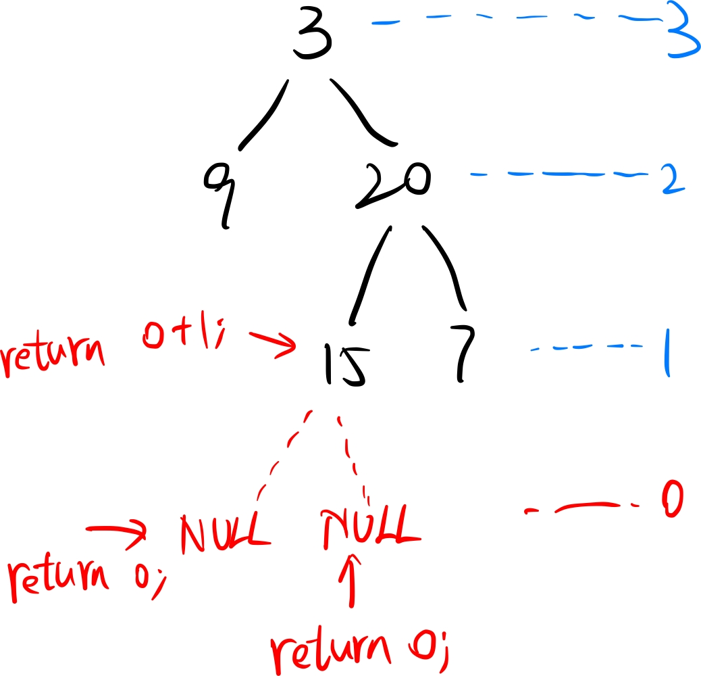

# 1 基础数据结构

## 1.1 数组/链表

### 1.1.0 杂题

- O(1)实现插入、删除、随机抓阄

  - leecode：380

  ```c++
  // 存储元素的值
  vector<int> nums;
  // 记录每个元素对应在 nums 中的索引
  unordered_map<int,int> valToIndex;
  
  删除的时候，将target与末尾元素交换位置，再删除（利用了元素无序性）
  ```

- O(1)随机抓阄，但不能在黑名单里

  - leecode：710

  - 同上，规定[0,N-blacklist.size())里的元素是有效的。于是需要把所有黑名单数移到末尾。

### 1.1.1 差分数组/前缀和

- 前缀和

  - 主要适用：原始数组**不被修改**的情况下，频繁查询**某个区间**的**累加和**。

    

    ```c++
    class PrefixSum {
        // 前缀和数组
        private int[] prefix;
    
        /* 输入一个数组，构造前缀和 */
        public PrefixSum(int[] nums) {
            prefix = new int[nums.length + 1];
            // 计算 nums 的累加和
            for (int i = 1; i < prefix.length; i++) {
                prefix[i] = prefix[i - 1] + nums[i - 1];
            }
        }
    
        /* 查询闭区间 [i, j] 的累加和 */
        public int query(int i, int j) {
            return prefix[j + 1] - prefix[i];
        }
    }
    ```

    

- 差分数组

  - 主要适用：频繁对原始数组的**某个区间**的元素进行**增减**。最后，问数组各个元素是多少。

  - 如果想对区间nums[i..j]的元素全部加 3，那么只需要让diff[i] += 3，然后再让diff[j+1] -= 3即可：

    

    ```c++
    class Difference {
        // 差分数组
        private int[] diff;
    
        public Difference(int[] nums) {
            assert nums.length > 0;
            diff = new int[nums.length];
            // 构造差分数组
            diff[0] = nums[0];
            for (int i = 1; i < nums.length; i++) {
                diff[i] = nums[i] - nums[i - 1];
            }
        }
    
        /* 给闭区间 [i,j] 增加 val（可以是负数）*/
        public void increment(int i, int j, int val) {
            diff[i] += val;
            if (j + 1 < diff.length) {
                diff[j + 1] -= val;
            }
        }
    
        public int[] result() {
            int[] res = new int[diff.length];
            // 根据差分数组构造结果数组
            res[0] = diff[0];
            for (int i = 1; i < diff.length; i++) {
                res[i] = res[i - 1] + diff[i];
            }
            return res;
        }
    }
    ```

  - leecode:1109

### 1.1.2 滑动窗口

- 处理各种字符串**子串问题**

  - 基本板子

    ```c++
    /* 滑动窗口算法框架 */
    // s是source，t是target
    void slidingWindow(string s, string t) {
        unordered_map<char, int> need, window;
        for (char c : t) need[c]++;
    
        int left = 0, right = 0;
        int valid = 0; 
        while (right < s.size()) {
            // c 是将移入窗口的字符
            char c = s[right];
            // 右移窗口
            right++;
            // 进行窗口内数据的一系列更新
            ...
    
            /*** debug 输出的位置 ***/
            printf("window: [%d, %d)\n", left, right);
            /********************/
    
            // 判断左侧窗口是否要收缩
            while (window needs shrink) {
                // d 是将移出窗口的字符
                char d = s[left];
                // 左移窗口
                left++;
                // 进行窗口内数据的一系列更新
                ...
            }
        }
    }
    ```

  - 需要注意的细节

    ```c++
    /*顺序问题*/
    
    // 右移时，以下两者等价（左移同理）
    char c = s[right]; //本来没进来的，这次进入
    right++;
    
    right++; // 先移动，但因为左闭右开，所以需要r-1
    char c = s[right-1];
    ```

    ```c++
    /*终止条件*/
    
    // r<s.size()，可以每次都让r右移
    // 最后一次进while是r=n-1，r进去后取n。由于是[l,r)所以正好
     while (right < s.size()) {}
    ```

    ```c++
    /*一些细节*/
    
    //先看这次进入的字符是不是需要的
    if(need.count(c)){...}
    ```

- 最小覆盖子串

  - leecode：76

- 字符串排列

  - leecode：567

- 最长无重复子串

  - leecode：3

### 1.1.3 二分查找（边界）

- 查找**左边界**时，返回的是“**比target小的个数**”

  - > `nums = [1,1,7,7,13], target = 7`，返回 2
    >
    > `nums = [2,3,5,7], target = 8`，返回 4
    >
    > `nums = [2,3,5,7]`,`target = 1`，返回 0

  - 板子

  ```c++
  // 查找左边界时
  int left_bound(int[] nums, int target) {
      if (nums.length == 0) return -1;
      int left = 0;
      // 查找范围为[left,right)
      int right = nums.length; // 注意
  	// 当出现[2,2)时，[2,2)内已经没有元素了，退出条件为left==right
      while (left < right) { // 注意
          int mid = (left + right) / 2;
          if (nums[mid] == target) {  // 目前的命中，去[left,mid)继续找
              right = mid;
          } else if (nums[mid] < target) {  // 目前的小了，去[mid+1,right)继续找
              left = mid + 1;
          } else if (nums[mid] > target) {  // 目前的大了，去[left,mid)继续找
              right = mid; // 注意
          }
      }
      // 如果nums存在target，那left指向最左的target
      // 如果nums不存在target，那left指向第一个比target大的数（有可能==nums.size)
      return left;
  }
  ```

- 同理，**右边界**

  - 右边界的return是**left-1**(right-1)，与左边界不同
    - 究其根本，是在[left,right)模式下，nums[mid]==target时，左边界与右边界的处理策略不同。左边界时，是[left,mid)；右边界时，是[mid+1,right)。正是因为右边界需要+1，才使得return需要left-1

  ```c++
  int right_bound(int[] nums, int target) {
      if (nums.length == 0) return -1;
      int left = 0;
      // 查找范围为[left,right)
      int right = nums.length; // 注意
  	// 当出现[2,2)时，[2,2)内已经没有元素了，退出条件为left==right
      while (left < right) { // 注意
          int mid = (left + right) / 2;
          if (nums[mid] == target) {  // 目前的命中，去[mid+1,right)继续找
              left = mid + 1;
          } else if (nums[mid] < target) {  // 目前的小了，去[mid+1,right)继续找
              left = mid + 1;
          } else if (nums[mid] > target) {  // 目前的大了，去[left,mid)继续找
              right = mid; // 注意
          }
      }
      // 如果nums存在target，那left-1指向最右的target
      // 如果nums不存在target，那left-1指向第一个比target大的数（所以有可能==nums.size)
      return left-1;
  }
  ```

- 当nums中不存在target时，不会进入nums[mid] == target的情况。左边界与右边界行为一致，都指向**第一个比target大的数**

### 1.1.4 双指针技巧

#### 1.1.4.1 快慢指针

- 一般慢指针一次走一步，快指针一次走两步

- 判断链表**是否有环**

  - 快与慢相遇则有环

    ```c++
    boolean hasCycle(ListNode head) {
        ListNode fast, slow;
        fast = slow = head;
        // 差一步走到头 && 走到头了 都需要特判
        while (fast != null && fast.next != null) {
            fast = fast.next.next;
            slow = slow.next;
    
            if (fast == slow) return true;
        }
        return false;
    }
    ```

- 已知链表中含有环，返回这个环的**起始位置**

  - 相遇一次后，让两个指针**都变为一次一步**，再走一次，相遇处即是环起点

    - 原因：设环长度为c、一开始slow走k步，则fast走2k步。设第一次相遇处距离环起始m步。则head至环起点有k-m步。考察fast比slow多走的k步，一定是c的整数倍（slow一定会在一圈内被fast追上，于是fast除去直线与环的小尾巴：2k-((k-m)+m)=k，k是纯走环的距离）。于是让slow从head走k-m步时达到环起点，而此时，fast在环内从m处走了k-m步，也到达环起点。

    ```c++
    ListNode detectCycle(ListNode head) {
        ListNode fast, slow;
        fast = slow = head;
        while (fast != null && fast.next != null) {
            fast = fast.next.next;
            slow = slow.next;
            if (fast == slow) break;
        }
        // 上面的代码类似 hasCycle 函数
        slow = head;
        while (slow != fast) {
            // fast一次走一步
            fast = fast.next;
            slow = slow.next;
        }
        return slow;
    }
    ```

- 寻找**环中点**

  - 当链表的长度是**奇数**时，`slow`恰巧停在**中点位置**；如果长度是**偶数**，`slow`最终的位置是**中间偏右**

    ```c++
    ListNode middleNode(ListNode head) {
        ListNode fast, slow;
        fast = slow = head;
        while (fast != null && fast.next != null) {
            fast = fast.next.next;
            slow = slow.next;
        }
        // slow 就在中间位置
        return slow;
    }
    ```

- 删除**倒数第n个**元素

  - 快指针先走`n`步，然后快慢指针开始同速前进

    ```c++
    ListNode removeNthFromEnd(ListNode head, int n) {
        ListNode fast, slow;
        fast = slow = head;
        // 快指针先前进 n 步
        while (n-- > 0) {
            fast = fast.next;
        }
        if (fast == null) {
            // 如果此时快指针走到头了，
            // 说明倒数第 n 个节点就是第一个节点
            return head.next;
        }
        // 让慢指针和快指针同步向前
        while (fast != null && fast.next != null) {
            fast = fast.next;
            slow = slow.next;
        }
        // slow.next 就是倒数第 n 个节点，删除它
        slow.next = slow.next.next;
        return head;
    }
    ```

#### 1.1.4.2 左右指针

目前看，左右指针一般应用于**有序数组**

- 二分查找

- 两数之和

  - 给定升序排列的数组，找出两个数，求和等于target

    - 暴力需要$O(n^2)$，用左右指针只需要$O(n)$
    - 最初，小的最小，大的最大。如果此时sum<target，一定怪罪于小的太小了（大的都已经最大了）；同理，sum>target，是因为大的太大了。以sum>target为例，于是，开始把大的向左移，直到sum<target为止。此时，问题就出现在小的上了，把小的向右移，以此类推。

    ```c++
    int[] twoSum(int[] nums, int target) {
        int left = 0, right = nums.length - 1;
        while (left < right) {
            int sum = nums[left] + nums[right];
            if (sum == target) {
                // 题目要求的索引是从 1 开始的
                return new int[]{left + 1, right + 1};
            } else if (sum < target) {
                left++; // 让 sum 大一点
            } else if (sum > target) {
                right--; // 让 sum 小一点
            }
        }
        return new int[]{-1, -1};
    }
    ```

- 反转数组

- 滑动窗口

- 田忌赛马

  - leecode:870
  - 为排序好的设置left和right，每派出去一个，就向中间移动一次


#### 1.1.4.3 O(1)空间问题

- 数组去重、移除特定元素
  - leecode：26、27
  - slow指针在后面等着，每当fast找到一个ans里应该存在的数，就放进slow里，slow++

### 1.1.5 链表合并

- 合并2个有序链表

  - leecode：21

  - 共设置四个指针

    - ans，ans->next是最后返回的答案（虚拟头结点）
    - head，此时“ans链”的头结点，即：下一个结点放入head.next
    - p1、p2，遍历两个链

    

    

  - 有可能p1先结束了，之后需要两个while确保p1和p2都结束

- 合并k个有序链表

  - 大致与2个相同，不过需要使用一个priority_queue，比较每次的k个元素

### 1.1.6  链表反转

- 将一个链表反转（顺序）

  - 代码

    ```c++
    ListNode* reverseList(ListNode* head) {
        ListNode* pre=nullptr,cur=head;
    	if(head==nullptr) return head;
    	while(cur!=nullptr){
    		tmp=cur->next;
    		cur->next=pre;
    		pre=cur;
    		cur=tmp;
    	}
    	return pre;
    }
    ```

    

- 将一个链表反转（递归）

  - 代码

    ```c++
    ListNode reverse(ListNode head) {
        if (head.next == null) return head;
        ListNode last = reverse(head.next);
        head.next.next = head;
        head.next = null;
        return last;
    }
    ```

  - 思路

    - **对于递归算法，最重要的就是明确递归函数的定义**。具体来说，我们的`reverse`函数定义是这样的：

      **输入一个节点`head`，将「以`head`为起点」的链表反转，并返回反转之后的头结点**。

    - 明白了函数的定义，再来看这个问题。比如说我们想反转这个链表：

      

    - 那么输入`reverse(head)`后，会在这里进行递归：

      ```
      ListNode last = reverse(head.next);
      ```

    - 不要跳进递归（你的脑袋能压几个栈呀？），而是要根据刚才的函数定义，来弄清楚这段代码会产生什么结果：

      

    - 按照定义，这个`reverse(head.next)`执行完成后，整个链表应该变成了这样：

      

    - 并且根据函数定义，`reverse`函数会返回反转之后的头结点，我们用变量`last`接收了。

      现在再来看下面的代码：

      ```
      head.next.next = head;
      ```

      

    - 接下来进行的操作：

      ```
      head.next = null;
      return last;
      ```

      

    - 神不神奇，这样整个链表就反转过来了！递归代码就是这么简洁优雅，不过其中有两个地方需要注意：

      **1、递归函数要有 base case**，也就是这句：

      ```
      if (head.next == null) return head;
      ```

      意思是如果链表只有一个节点的时候反转也是它自己，直接返回即可。

      **2、当链表递归反转之后，新的头节点是`last`，而之前的`head`变成了最后一个节点，别忘了链表的末尾要指向 null：**

      ```
      head.next = null;
      ```

      理解了这两点后，我们就可以进一步深入了，接下来的问题其实都是在这个算法上的扩展。

- 反转前N个结点

  - 同理，直接把reverseN当做已经实现完成去考虑。已知reverseN返回的是“反转之后的头结点”。

    ```c++
    ListNode reverseN(ListNode head, int n) {
        // base case
        {……}
        // 以 head.next 为起点，需要反转前 n - 1 个节点
        ListNode last = reverseN(head.next, n - 1);
    	// 反转处理
        {……}
        return last;
    }
    ```

  - 此时，链表变成了这样

    

  - 于是，只需要把2指向1,1指向4，返回3即可

    ```c++
    ListNode reverseN(ListNode head, int n) {
        // base case
        {……}
        // 以 head.next 为起点，需要反转前 n - 1 个节点
        ListNode last = reverseN(head.next, n - 1);
    	// 反转处理
        ListNode tmp = head.next;
        head.next = head.next.next;
        tmp.next = head;
        
        return last;
    }
    ```

  - 最后，解决base case问题

    ```c++
    ListNode reverseN(ListNode head, int n) {
        // base case
        if(n==1){
            return head;
        }
        // 以 head.next 为起点，需要反转前 n - 1 个节点
        ListNode last = reverseN(head.next, n - 1);
    	// 反转处理
        ListNode tmp = head.next;
        head.next = head.next.next;
        tmp.next = head;
        
        return last;
    }
    ```

- 反转[m,n]个节点

  - 只需要改变代码中的if(n==1)即可

## 1.2 队列/栈

### 1.2.1 括号匹配

- 多种括号正确性检验

  - 判断准则

    ```
    Input: "()[]{}"
    Output: true
    
    Input: "([)]"
    Output: false
    
    Input: "{[]}"
    Output: true
    ```

  - 代码

    - 思路：1.每次遇到一种右括号时，去看栈里的左括号是否与他匹配——不匹配就false 2.最后看左括号是否用完了。

    ```c++
    bool isValid(string str) {
        stack<char> left;
        for (char c : str) {
            if (c == '(' || c == '{' || c == '[')
                left.push(c);
            else { // 字符 c 是右括号
                if (!left.empty() && leftOf(c) == left.top())
                    left.pop();
                else
                    // 和最近的左括号不匹配
                    return false;
            }
        }
        // 是否所有的左括号都被匹配了
        return left.empty();
    }
    
    char leftOf(char c) {
        if (c == '}') return '{';
        if (c == ')') return '(';
        return '[';
    }
    ```

- 平衡括号串（1对1）

  - 输入一个字符串`s`，可以在其中的任意位置插入 左括号`(` 或者 右括号`) `，问最少需要几次插入才能使得`s`变成一个合法的括号串

  - 代码

    - leecode：921
    - 需要注意，遇到 “)” 后，对need--，此时如果need为负数，说明“此时左括号已经用完了，这个右括号是多的”。所以需要把need置回0，另外用res记录每个“多出来的右括号”

    ```c++
    int minAddToMakeValid(string s) {
        // res 记录插入次数
        int res = 0;
        // need 变量记录右括号的需求量
        int need = 0;
    
        for (int i = 0; i < s.size(); i++) {
            if (s[i] == '(') {
                // 对右括号的需求 + 1
                need++;
            }
    
            if (s[i] == ')') {
                // 对右括号的需求 - 1
                need--;
    
                if (need == -1) {
                    need = 0;
                    // 需插入一个左括号
                    res++;
                }
            }
        }
    
        return res + need;
    }
    ```

- 平衡括号串（1对2）

  - 1个 “（” 匹配2个 “）”

  - 有两点与上面不同

    - 当need=0，但出现了“）”
      - ex：`()))`。此时，一定需要插入一个"("，变成`())  ()`，并且之后需要再出现一个")"
    - 当need为奇数，但出现了"("
      - ex：`()(`。此时，一定需要插入一个")"，变成`()) (`，随之带来的是，对")"的需求就会少一个（第一个左括号想要两个，但都到了第二个左括号了，只出现了一个。那就只能告诉第一个左括号，你别再等那一个了，我直接插入给你）。

  - 代码

    - leecode:1541

    ```c++
    int minInsertions(string s) {
        //res：确认要插入的")"与"("，need：后面希望出现的")"
        int res = 0, need = 0;
    
        for (int i = 0; i < s.size(); i++) {
            if (s[i] == '(') {
                need += 2;
                if (need % 2 == 1) {
                    res++;
                    need--;
                }
            }
            if (s[i] == ')') {
                need--;
                if (need == -1) {
                    res++;
                    need = 1;
                }
            }
        }
        return res + need;
    }
    ```

### 1.2.2 单调栈

- 单调栈模板

  - 给你一个数组，返回一个等长的数组，对应索引存储着下一个更大元素，如果没有更大的元素，就存 -1。比如说，输入一个数组`nums = [2,1,2,4,3]`，你返回数组`[4,2,4,-1,-1]`。

  - 代码

    - 单调栈指的是，维护的那个栈，每个状态都是单调的。

    ```c++
    vector<int> nextGreaterElement(vector<int>& nums) {
        vector<int> res(nums.size()); // 存放答案的数组
        stack<int> s;
        // 倒着往栈里放
        for (int i = nums.size() - 1; i >= 0; i--) {
            // 判定个子高矮
            while (!s.empty() && s.top() <= nums[i]) {
                // 矮个起开，反正也被挡着了。。。
                s.pop();
            }
            // nums[i] 身后的 next great number
            res[i] = s.empty() ? -1 : s.top();
            // 
            s.push(nums[i]);
        }
        return res;
    }
    ```

- 单调栈+问索引差距

  - 给你一个数组`T`，这个数组存放的是近几天的天气气温，你返回一个等长的数组，计算：**对于每一天，你还要至少等多少天才能等到一个更暖和的气温；如果等不到那一天，填 0**。比如说给你输入`T = [73,74,75,71,69,76]`，你返回`[1,1,3,2,1,0]`。
  - 这里只需要让单调栈里**存数组索引**，每次去数组里取值即可

### 1.2.3 单调队列

- 返回一个滑动的定长窗口中的max

  - “如果我进来时，发现有人比我小，那么你一定没用 “

    - 原因：1. 你比我先进来，于是要先出去 2. 有我在的时候，max一定不是你。

  - 代码

    - 需要注意，初始只能填充k-1个。如果填充了k个，那for之外还需要再添加一次。

    ```c++
    class MonotonicQueue {
    private:
        deque<int> data;
    public:
        void push(int n) {
            while (!data.empty() && data.back() < n) 
                data.pop_back();
            data.push_back(n);
        }
        
        int max() { return data.front(); }
        
        void pop(int n) {
            if (!data.empty() && data.front() == n)
                data.pop_front();
        }
    };
    
    vector<int> maxSlidingWindow(vector<int>& nums, int k) {
        MonotonicQueue window;
        vector<int> res;
        for (int i = 0; i < nums.size(); i++) {
            if (i < k - 1) { //先填满窗口的前 k - 1
                window.push(nums[i]);
            } else { // 窗口向前滑动
                window.push(nums[i]);
                res.push_back(window.max());
                window.pop(nums[i - k + 1]);
            }
        }
        return res;
    }
    ```

### 1.2.4 去除重复字母

- 要求一、**要去重**。

  要求二、去重字符串中的字符顺序**不能打乱`s`中字符出现的相对顺序**。

  要求三、在所有符合上一条要求的去重字符串中，**字典序最小**的作为最终结果。

- 思路

  - 当x进栈时，发现栈顶的字符y比他大，此时，如果后面还有y，那已经进去的y应该之后再入栈（为了字典序最小）
    - 所以需要对每个字符进行**计数**
  - 如果字符c进栈，发现栈里已经有c了，那么新的c可以直接跳过
    - 原因：唯一一个不把新c跳过的理由，是“把c的位置从老c -> 新c，可以使得整体字典码变小”

  

  

- 代码

  ```c++
  class Solution {
  public:
      string removeDuplicateLetters(string s) {
  		int exist[256];
  		int cnt[256];
  		stack<char> ans;
  		string ans_s;
  
  		for(int i=1;i<=255;++i){
  			exist[i]=0;
  			cnt[i]=0;
  		}
  		for(auto i:s){
  			cnt[i]++;
  		}
  		for(auto c:s){
  			cnt[c]--;
  			if(exist[c]==1) continue;
  			exist[c]=1;
  			while(!ans.empty() && ans.top()>c && cnt[ans.top()]>0){
  				// cnt[ans.top()]--;  // 错误，扣除重复了。每个字符，只在进栈时，扣除cnt就可以
  				exist[ans.top()]=0; // 漏了
  				ans.pop();
  			}
  			ans.push(c);
  		}
  		while(!ans.empty()){
              // 出栈时，反着排
  			ans_s=ans.top()+ans_s;
  			ans.pop();
  		}
  		return ans_s;
      }
  };
  ```

## 1.3 数据结构设计

没学，https://mp.weixin.qq.com/s/00yRZUaU5c5KV-yTWhoDig，之后学吧

# 2 进阶数据结构

## 2.1 二叉树

### 2.1.1 前中后序

- **前中后序**是遍历二叉树过程中处理每一个节点的**三个特殊时间点**，绝不仅仅是三个顺序不同的 List
  - **前**序位置的代码在**刚刚进入**一个二叉树节点的时候执行
  - **后**序位置的代码在**将要离开**一个二叉树节点的时候执行
  - **中**序位置的代码在一个二叉树节点左子树都遍历完，即将开始遍历右子树的时候执行。

- 框架

  ```c++
  void traverse(TreeNode root) {
      if (root == null) {
          return;
      }
      // 前序位置
      traverse(root.left);
      // 中序位置
      traverse(root.right);
      // 后序位置
  }
  ```

  

- 核心思路：**二叉树的所有问题，就是让你在前中后序位置注入巧妙的代码逻辑，去达到自己的目的**。只需要思考每一个节点应该做什么，其他的不用管，抛给二叉树遍历框架，递归会对所有节点做相同的操作。

### 2.1.2 后序遍历的特殊性

- **前序位置**的代码**只能**从函数参数中获取**父节点**传递来的数据，而**后序位置**的代码不仅可以获取**参数数据**，还可以获取到**子树通过函数返回值传递回来的数据**。
- 一旦你发现**题目和子树有关**，那大概率要给函数设置合理的定义和返回值、**在后序位置写代码了**。

### 2.1.3 递归 实战

#### 2.1.3.1 二叉树的最大深度

- 法1

  - why：在前序位置增加`depth`，在后序位置减小`depth`
    - ans：前序位置是进入一个节点的时候，后序位置是离开一个节点的时候，`depth`记录当前递归到的节点深度，所以要这样维护

  ```c++
  // 记录最大深度
  int res = 0;
  // 记录目前节点的深度
  int depth = 0;
  
  // 主函数
  int maxDepth(TreeNode root) {
      traverse(root);
      return res;
  }
  
  // 二叉树遍历框架
  void traverse(TreeNode root) {
      if (root == null) {
          // 到达叶子节点，更新最大深度
          res = Math.max(res, depth);
          return;
      }
      // 前序位置
      depth++;
      // 中序位置
      traverse(root.left);
      traverse(root.right);
      // 后序位置
      depth--;
  }
  ```

- 法2

  - NULL时需要返回0，而不是1

    

  ```c++
  // 定义：输入根节点，返回这棵二叉树的最大深度
  int maxDepth(TreeNode* root) {
      if (root == NULL) {
          return 0;
      }
      // 利用定义，计算左右子树的最大深度
      int leftMax = maxDepth(root->left);
      int rightMax = maxDepth(root->right);
      // 整棵树的最大深度等于左右子树的最大深度取最大值，
      // 然后再加上根节点自己
      int res = max(leftMax, rightMax) + 1;
  
      return res;
  }
  ```

#### 2.1.3.2 后序遍历特殊性

- 二叉树的最大直径

  - leecode：543

  - 二叉树的「直径」长度，就是任意两个结点之间的路径长度。

  - 思路

    - 对每个节点做如下计算
      - 求出：”以当前节点为root，由left通过root，再通过right“的最大路程max_i
    - 在所有节点的max_i中，取最大，即是全图的最大

  - 解释

    - 无论「直径」长什么样，一定存在一个“最高点”。那把这个“最高点”作为root，则满足上述求解过程。所以一定能被上述过程求出。

  - 代码

    ```c++
    class Solution {
        int ans;
        int depth(TreeNode* root){
            if (root == NULL) return 0;
            int L = depth(root->left);
            int R = depth(root->right);
            ans = max(ans, L + R);
            return max(L, R) + 1;
        }
    public:
        int diameterOfBinaryTree(TreeNode* root) {
            ans = 0;
            depth(root);
            return ans;
        }
    };
    ```


## 二叉搜索树

## 图论

# 暴力搜索算法

## DFS 算法/回溯算法

## BFS 算法

# 动态规划

## 动态规划核心原理

## 经典动态规划

## 背包问题

## 用动态规划玩游戏

# 其他经典算法

## 数学算法

## 面试必知必会


st表、线段树 逆天