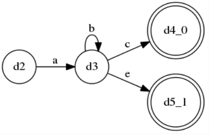
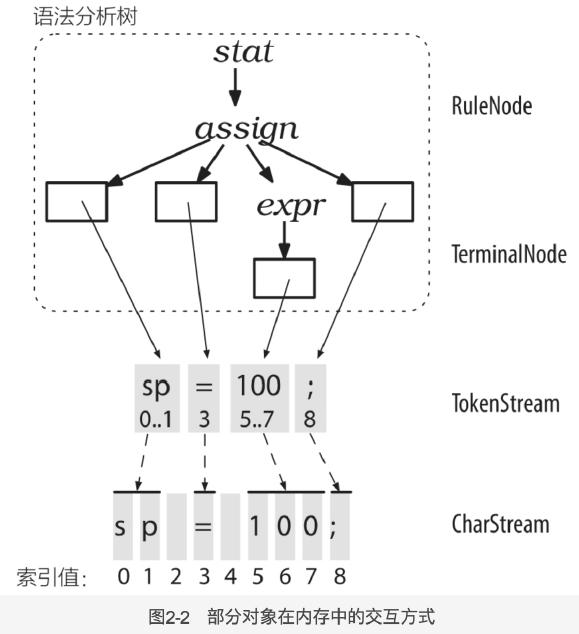

# antlr

## 资料

- [Anrlr4 生成C++版本的语法解析器](https://www.cnblogs.com/fanzhenyong/p/11638642.html)

## overview

- LL(*)

  - 超前看的token个数可变，有可能出现跳过非常多个的情况（ex：跳过b*）

    

- 递归下降，属于自顶向下

- ANTLR解决歧义问题的方法是:选择所有匹配的备选分支中的第一条。在上面的例子中，ANTLR将会选择左边的语法分析树作为对输入文本“f ()”的语义解释。

  - 有关词法分析中歧义性的更多信息，请参阅5.5节中“匹配标识符”部分。要注意的是，词法分析器会匹配**可能的最长字符串**来生成一个词法符号，这意味着，输入文本beginner只会匹配上例中的ID这条词法规则。ANTLR词法分析器不会把它匹配为关键字BEGIN后跟着标识符ner。

- 5.4节，处理表达式运算符优先级

- 11章，处理"i*j"，是1\*2，还是int\* x

- 内存中

  

- 第五章，如何写语法。第7章，监听器、访问器（默认listener）。

- 编译顺序：因此，我们完成工作的一般步骤是:首先我们对一个语法运行ANTLR，然后将生成的代码与jar包中的运行库一起编译，最后将编译好的代码和运行库放在一起运行。

- 生成文件

  ```
  **Parser.java // 语法分析器类，处理**的解析（类似于总接口）
  **Lexer.java  // 词法、文法
  **.tokens // 词法符号 对应 数字形式的类型
  **Listener.java **BaseListener.java // 在遍历语法分析树时，遍历器能够触发一系列“事件”(回调)，并通知我们提供的监听器对象。通过override其中的函数，完成对需要的函数修改
  ```

- 如何调试 p63

## 语法

- 概况

  ```
  /** 可根据需要撰写 javadoc 风格的注释，可以是单行、多行*/
  grammar Name; // 需要与文件名相同，相当于java里的package
  
  //注意以下options imports tokens actions指定顺序可以任意调换
  
  options {name1=value1; ... nameN=valueN;} 
  import ... ;
   	
  tokens { Token1, ..., TokenN }
  channels {...} // 只能是词法分析时才能定义
  @actionName {...}
   	 
  rule1 // 语法和词法分析规则定义，也有可能是混合在一起的规则定义
  ...
  ruleN
  ```

  