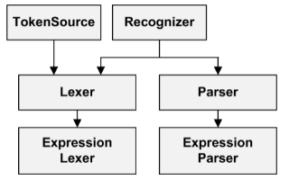
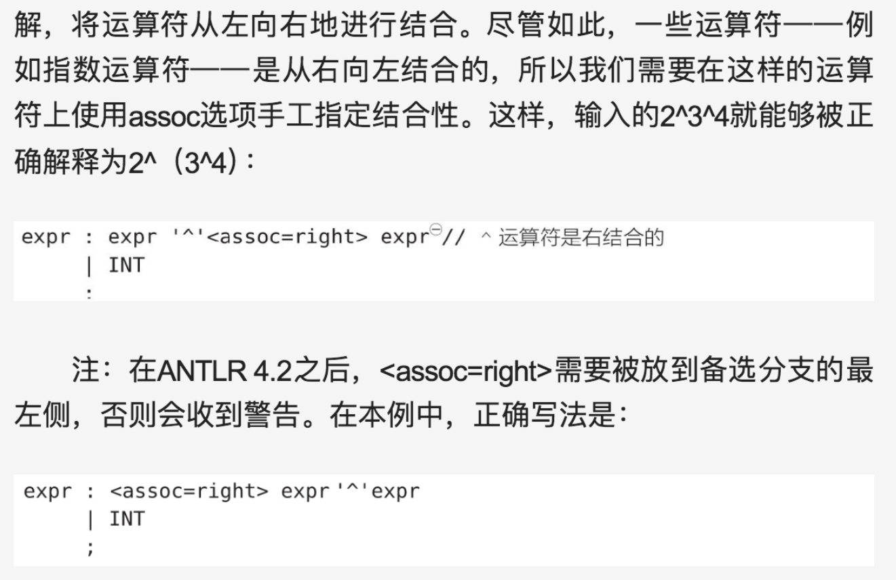

# antler

## 资料

- [Anrlr4 生成C++版本的语法解析器](https://www.cnblogs.com/fanzhenyong/p/11638642.html)

## overview

- LL(*)

  - 超前看的token个数可变，有可能出现跳过非常多个的情况（ex：跳过b*）

    

- 递归下降，属于自顶向下

- ANTLR解决歧义问题的方法是:选择所有匹配的备选分支中的第一条。在上面的例子中，ANTLR将会选择左边的语法分析树作为对输入文本“f ()”的语义解释。

  - 有关词法分析中歧义性的更多信息，请参阅5.5节中“匹配标识符”部分。要注意的是，词法分析器会匹配**可能的最长字符串**来生成一个词法符号，这意味着，输入文本beginner只会匹配上例中的ID这条词法规则。ANTLR词法分析器不会把它匹配为关键字BEGIN后跟着标识符ner。

- 5.4节，处理表达式运算符优先级

- 11章，处理"i*j"，是1\*2，还是int\* x

- 内存中

- 第五章，如何写语法。第7章，监听器、访问器（默认listener）。

- 编译顺序：因此，我们完成工作的一般步骤是:首先我们对一个语法运行ANTLR，然后将生成的代码与jar包中的运行库一起编译，最后将编译好的代码和运行库放在一起运行。

- 生成文件

  ```
  **Parser.java // 语法分析器类，处理**的解析（类似于总接口）
  **Lexer.java  // 词法、文法
  **.tokens // 词法符号 对应 数字形式的类型
  **Listener.java **BaseListener.java // 在遍历语法分析树时，遍历器能够触发一系列“事件”(回调)，并通知我们提供的监听器对象。通过override其中的函数，完成对需要的函数修改
  ```

- 如何调试 p63

## 语法

- 概况

  ```
  /** 可根据需要撰写 javadoc 风格的注释，可以是单行、多行*/
  grammar Name; // 需要与文件名相同，相当于java里的package
  
  //注意以下options imports tokens actions指定顺序可以任意调换
  
  options {name1=value1; ... nameN=valueN;} 
  import ... ;
   	
  tokens { Token1, ..., TokenN }
  channels {...} // 只能是词法分析时才能定义
  @actionName {...}
   	 
  rule1 // 语法和词法分析规则定义，也有可能是混合在一起的规则定义
  ...
  ruleN
  ```

  


# antlr

## 资料

- [Anrlr4 生成C++版本的语法解析器](https://www.cnblogs.com/fanzhenyong/p/11638642.html)
- [antlr c++ 初入门](https://www.cnblogs.com/zitonglove/p/11364441.html)
- c++ antlr,运行时整体配置 https://zhuanlan.zhihu.com/p/240229064
- 大量语法：https://github.com/teverett/antlr4example/blob/master/src/main/antlr4/com/khubla/antlr4example/Cobol85.g4
- 跟着学 https://www.codeproject.com/Articles/5308882/ANTLR-Parsing-and-Cplusplus-Part-1-Introduction

## 运行

```
alias antlr4='java -jar /home/yundao/course/junior2/antlr/antlr-4.9.3-complete.jar'

alias grun='java org.antlr.v4.gui.TestRig'

antlr4 test.g4

javac test*.java

grun Hello r -gui Text.txt// Hello为grammar名，r为最顶层的规则名,Text.txt为输入语句
```


## overview

- LL(*)

  - 超前看的token个数可变，有可能出现跳过非常多个的情况（ex：跳过b*）

    

- 递归下降，属于自顶向下

- ANTLR解决歧义问题的方法是:选择所有匹配的备选分支中的第一条。在上面的例子中，ANTLR将会选择左边的语法分析树作为对输入文本“f ()”的语义解释。

  - 有关词法分析中歧义性的更多信息，请参阅5.5节中“匹配标识符”部分。要注意的是，词法分析器会匹配**可能的最长字符串**来生成一个词法符号，这意味着，输入文本beginner只会匹配上例中的ID这条词法规则。ANTLR词法分析器不会把它匹配为关键字BEGIN后跟着标识符ner。

- 5.4节，处理表达式运算符优先级

- 11章，处理"i*j"，是1\*2，还是int\* x

- 内存中

  

- 第五章，如何写语法。第7章，监听器、访问器（默认listener）。

- 编译顺序：因此，我们完成工作的一般步骤是:首先我们对一个语法运行ANTLR，然后将生成的代码与jar包中的运行库一起编译，最后将编译好的代码和运行库放在一起运行。

- 生成文件

  ```
  **Parser.java // 语法分析器类，处理**的解析（类似于总接口）
  **Lexer.java  // 词法、文法
  **.tokens // 词法符号 对应 数字形式的类型
  **Listener.java **BaseListener.java // 在遍历语法分析树时，遍历器能够触发一系列“事件”(回调)，并通知我们提供的监听器对象。通过override其中的函数，完成对需要的函数修改
  ```

- 如何调试 p63

## 语法

- 概况

- ```
  /** 可根据需要撰写 javadoc 风格的注释，可以是单行、多行*/
  grammar Name; // 需要与文件名相同，相当于java里的package
  
  //注意以下options imports tokens actions指定顺序可以任意调换
  
  options {name1=value1; ... nameN=valueN;} 
  import ... ;
   	
  tokens { Token1, ..., TokenN }
  channels {...} // 只能是词法分析时才能定义
  @actionName {...}
   	 
  rule1 // 语法和词法分析规则定义，也有可能是混合在一起的规则定义
  ...
  ruleN
  ```
  
- rule

  - lexer rules  follow  the parser rules

  ```c++
  DIGIT : "0" | "1" | "2" | "3" | "4" | "5" | "6" | "7" | "8" | "9"; // 任选一个
  ALPHA_CHAR : "a"-"z" | "A"-"Z"; // 一个范围
  {digit} // >=0次
  [digit] // 0或1次
  (x|y|z)? // nothing or 任意一个
  (x|y|z)* // >=0次
  (x|y|z)+ // >=1次
  ~ // 不取谁
  ex：
      "TEST"?，will match nothing or "TEST"
      INT : [0-9]+;
  	ID : [a-z]+;
  
  // fragment
  fragment 集成已有的token，增加可读性
  ex：
      SCI_NUMBER : ('+'|'-')? DIGIT+ '.' DIGIT* EXPONENT?;
  	fragment EXPONENT : ('e'|'E') ('+'|'-') ? DIGIT+;
  	fragment DIGIT : '0'-'9';
  
  // ->
  WS : [ \t\r\n]+ -> skip;
  INT : [0-9]+ -> type(STRING); // 从int转为string
  
  //exception
  catch[ExceptionClass e] { process e }
  ```

  ## 基础类

  

### Token Classes

  - 4.1

  - 

    - Token类十个纯虚函数

### Stream Classes

  - 4.2

    

    - 7个函数，5个构造函数

### The Lexer Class

- 4.3

  

-  `getRuleNames()` 、getTokenNames()

### The Parser Class

- 4.4.

- 4.4.1 Functions related to tokens
- 4.4.2 Functions related to parse trees and parse tree listeners
- 4.4.3 Functions related to errors
- 4.4.4 Functions related to rules and rule contexts

## 解析树和规则上下文

### ParseTree 类

- 5.1

- 与树相关的类包括`ParseTree`、`TerminalNode`、`ParseTreeVisitor`和`ParseTreeWalker`，它们都属于`antlr4::tree`命名空间。尽管名字是树，一个`ParseTree`**表示**解析树的**单个节点**，而不是整个树
- 函数们
  - `ParseTreeVisitor`s 和`ParseTreeWalkers`
  - `accept(ParseTreeVisitor*)`- 允许访问者访问节点的数据
  - `toString()`- 返回一个`string`包含节点数据的
  - `toStringTree(Parser* parser, bool pretty = false)`- 返回`string`整个树的包含数据

### RuleContext 类

### ParserRuleContext 类

- 跟踪上下文中的开始和结束标记。这些可以通过调用`getStart`和来访问`getStop`。应用程序还可以通过调用来找出文本的哪一部分与上下文相对应`getSourceInterval()`。

### ExprContext 类

## 语法

- 左递归：靠表达式出现的先后顺序

- 右递归

  

- 看的清楚

  

  

  

  

  

  

- 哪怕这样写，enum也是先匹配enumDef

  

- 贪婪匹配 与 非贪婪匹配

  ```
  . 代表任意字符
  .*? 在完成父匹配的前提下，尽量匹配少的字符。一般用于“”之前的字符的匹配
  .*  是贪婪的
  ```

- 如何匹配一个带着“”的string

  

- 忽略注释

  

## 第七章 visitor&&listener

- 在本章中，我们将会学习如何使用语法分析树监听器和访问器来构建语言类应用程序。监听器能够对特定规则的进入和退出事件（(即识别到某些词组的事件）作出响应，这些事件分别由语法分析树遍历器在开始和完成对节点的访问时触发。另外，ANTLR自动生成的语法分析树也支持广为人知的访问者模式，从而允许程序控制语法分析树的遍历过程。
- 

### 各种类

#### overview

- Listener


- Visitor

  - 比Listener少一层

  

#### 自动生成的类

- Listener

  - ***Listener

  

  - ***BaseListener

    - 包含所有方法的空实现

  - 如果加入了 #的标签

    

    

    

  - 

- Visitor:在命令行中使用“-visitor”选项时，ANTLR自动生成 ***Visitor和默认实现类\*\*\*BaseVisitor

  

- xContext

  - 1

#### 自己的

- 使用Listener

  - ***Loader

  

  

  - main

    

- 使用Visitor

  - ***Visitor

  

  

  - main

  

### 在事件中共享信息

- 使用访问器

  - 计算器
    - visit函数是自带的
    - visit函数 就是所谓的“自己触发对树节点的访问”

  

  

- 使用栈

  - 计算器2

    

- 使用Map

  - 计算器3

    - Map不能用普通的map（会出现key一样的节点），得用人家封装好的map

      

    - 写个这个map的存取

      

    - Int

      

    - 加法

      

    - 默认文法的开始是“S”

      

    - main函数

      D:\course\junior2\项目制3\tpantlr2-code (1)\code\listeners\TestLEvaluatorWithProps.java

# 实验三


## 三地址码规范

- 函数调用

  ```
  ```

  

