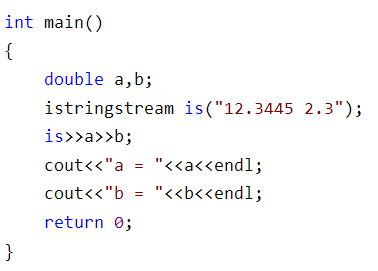

# 基础

## 零散

- sort

  - 1

  ```c++
  #include <iostream>
  
  vector<int> nums;
  n=nums.size();
  
  sort(nums.begin(),nums.end(),仿函数/bool函数);
  sort(nums.begin(),nums.begin()+n,仿函数/bool函数);
  ```

- const

  - 如果对象不是针对，它们没有区别

  ```c++
  int const x = 3;
  const int x = 3;
  ```

  - 如果对象是指针，它们有区别

  ```c++
  // const修饰p，所以p不能变
  int* const p = &array // 指针p不能够指向其他地址
      
  // const修饰int*，所以不能改指向的东西
      
  const int* p = &array // 指针p只读`&array`，不能够对其进行修改
  ```

- C++11标准增加了全局函数std::to_string

  - 泛型做的很好，直接调用就完了

  

## 函数传参

- 按值传参，按址传参，引用传参

  - 按值传参

    最简单，被调函数开栈空间，存储传入参数的复制

  - 按址传参

    - 若把int*看成是一种数据类型，则此时，与按值传参等价（因为需要开辟新空间存储x与y）

    ```c++
    void swap(int *x,int *y)
    {
       int p=*x;
       *x=*y;
       *y=p;
    }
    
    int a=1,b=2;
    swap(&a,&b);
    ```

  - 引用传参

    - x与a、y与b **完全等价**，地址相同，值也相同

    ```c++
    void swap(int &x,int &y)
    {
        int p=x; 
        x=y;
        y=p;
    }
    
    int a=1,b=2;
    swap(&a,&b);
    ```

    

## 类

### 构造函数

- 显式构造

  ```c++
  // 例如：Name是一个类
  
  Name name("yundao0");
  ```

  

- 隐式构造

  ```c++
  // 例如：Name是一个类
  
  // 若构造函数只有1个参数时
  // 若构造函数有多个参数，但除了第1个，其他的都有缺省值，也算！
  Name name = “yundao”;
  name = "Tom"; //会创建新的Name实例，构造函数参数为“Tom”
  
  // 除此之外，还可以使用{}进行隐式构造
  S s={1,2};
  ```
  
  - 在C++中, 如果构造函数只有1个参数时, 那么在编译的时候就会有一个缺省的转换操作:将赋的值带入构造函数

### 构造函数被调用

```
class S{
public:
	int a,int b;
	S(){}
	S(int a_,int b_):a(a_),b(b_){}
};

S ss[5]; //调用S()
```


### explicit

- 使用explicit关键字修饰构造函数，使构造函数强制为**显示构造函数**，不能进行隐式构造

### final

- 修饰类时，此类不能被继承
- 修饰函数时，此函数不能被子类重载

# STL

## overview

- 资料

  - [C++学习笔记——STL学习笔记]: https://blog.csdn.net/Stretch9776/article/details/12013316

  - [刷题常用STL函数整理合集]: https://blog.csdn.net/fantacy10000/article/details/95974634

- **定义**
  - STL(standard template library) ，中文可译为**标准模板库**或者**泛型库**，其包含有大量的模板类和模板函数，是 C++ 提供的一个基础模板的集合，用于完成诸如输入/输出、数学计算等功能。如今 STL 已完全被内置到支持 C++ 的编译器中，无需额外安装，STL 就位于各个 C++ 的头文件中，即它并非以二进制代码的形式提供，而是以源代码的形式提供。
- **六大模块**：容器（container），算法（algorithm），迭代器（iterator），仿函数（functor），配接器（adapter），配置器（allocator）

| **组件**            | **描述**                                                     |
| ------------------- | ------------------------------------------------------------ |
| 容器（Containers）  | 容器是用来管理某一类对象的集合。C++ 提供了各种不同类型的容器，比如 deque、list、vector、map 等。 |
| 算法（Algorithms）  | 算法作用于容器。它们提供了执行各种操作的方式，包括对容器内容执行初始化、排序、搜索和转换等操作。 |
| 迭代器（iterators） | 迭代器用于遍历对象集合的元素。这些集合可能是容器，也可能是容器的子集。 |
| 仿函数              | 如果一个类将 () 运算符重载为成员函数，这个类就称为函数对象类，这个类的对象就是函数对象（又称函数对象）。 |
| 适配器              | 可以使一个类的接口（模板的参数）适配成用户指定的形式，从而让原本不能在一起工作的两个类工作在一起。值得一提的是，容器、迭代器和函数都有适配器。 |
| 内存分配器          | 为容器类模板提供自定义的内存申请和释放功能，由于往往只有高级用户才有改变内存分配策略的需求，因此内存分配器对于一般用户来说，并不常用。 |


## 算法

### transform

- C++/C++11中std::transform的使用：https://blog.csdn.net/fengbingchun/article/details/63252470

- transform：对一个范围内的所有元素施加某种操作

  ```c++
  int op_increase(int i) {return (i + 5)};
  // 将[first1, last1)范围内的每个元素加5，然后依次存储到result中。
  std::transform(first1, last1, result, op_increase);
  ```

  ```c++
  int op_add(int, a, int b) {return (a + b)};
  // 将first1和first2开头的范围内的每个元素相加，然后依次存储到result中。
  std::transform(first1, last1, first2, result, op_add);
  ```

- 实例

  ```c++
  #include "transform.hpp"
  #include <algorithm> // std::transform
  #include <string>
  #include <cctype> // std::toupper
  #include <iostream>
  #include <vector>
  #include <functional> // std::plus c++14
   
  int test_transform1()
  {
  // example 1
  	std::string s("Hello");
      
  	std::transform(s.begin(), s.end(), s.begin(),[](unsigned char c) { return std::toupper(c); });// s变为 HELLO
   
  	std::transform(s.begin(), s.end(), s.begin(), ::tolower);// s变为 hello
  
  // example 2	
  	std::vector<int> arr{ 1, 3, 5 };
  	std::vector<int> arr2{ 1, 3, 5 };
  	std::vector<int> arr3{ 1, 3, 5 };
   // 下面三种，效果一致
      // 1
  	std::transform(arr.begin(), arr.end(), arr.begin(),[](int d) -> int {return d * 5; }); 
   	// 2
  	std::for_each(arr2.begin(), arr2.end(), [](int& a) {a *= 5; });
   	// 3
  	for (auto& value : arr3) {
  		value *= 5;
  	}
      
  // example 3 
  	std::vector<std::string> names = { "hi", "test", "foo" };
  	std::vector<std::size_t> name_sizes;
   
  	std::transform(names.begin(), names.end(), std::back_inserter(name_sizes),
  		[](std::string name) { return name.size(); });// name_sizes：2 4 3
   
  	std::for_each(name_sizes.begin(), name_sizes.end(), [](std::size_t name_size) {
  		std::cout << name_size << "    "; // cout：2 4 3
  	});
   
  	return 0;
  }
   
  /
  // reference: http://www.cplusplus.com/reference/algorithm/transform/
  static int op_increase(int i) { return ++i; }
   
  int test_transform2()
  {
  	std::vector<int> foo;
  	std::vector<int> bar;
   
  	// set some values:
  	for (int i = 1; i<6; i++)
  		foo.push_back(i * 10); // foo: 10 20 30 40 50
   
  	bar.resize(foo.size()); // allocate space
   
  	std::transform(foo.begin(), foo.end(), bar.begin(), op_increase);
  	// bar: 11 21 31 41 51
   
  	// std::plus adds together its two arguments:
  	std::transform(foo.begin(), foo.end(), bar.begin(), foo.begin(), std::plus<int>());// foo: 21 41 61 81 101
  	
  	std::cout << "foo contains:";
  	for (std::vector<int>::iterator it = foo.begin(); it != foo.end(); ++it)
  		std::cout << ' ' << *it; // 21 41 61 81 101
   
  	return 0;
  }
   
  ```


### count_if

- 数满足fun的个数

  ```c++
  bool fun(int x)
  {
  	return x % 2== 0;
  }
  
  int count = count_if(vec.begin(),vec.end(),fun);
  ```

  

## 仿函数

- 资料

  - [c++仿函数和函数适配器]: https://blog.csdn.net/coolwriter/article/details/81533226

    - 说的很详细，仿函数的状态等

- 一般用于：**容器构造时**、**算法（STL的）需要时**

- 内置的仿函数

  ```c++
  // 用于sort时，是“左边的是greater的”
  // 用于priority_queue时，也是“左边的是greater的”
  greater<T>() 
      
  less<T>() // 用于sort时，是“左边的是less的”    
  ```

  

- 构造

  - class和struct都可以

    ```c++
    struct tmp2 //重写仿函数
    {
        // 重载()运算符
        bool operator() (tmp1 a, tmp1 b) 
        {
            return a.x < b.x; //大顶堆
        }
    };
    // tmp1是自己的数据结构,tmp2指导如何排序tmp1
    priority_queue<tmp1, vector<tmp1>, tmp2> f;
    ```

## 迭代器

- 普通迭代器

  - vector

  ```c++
  for (std::vector<int>::iterator it = foo.begin(); it != foo.end(); ++it)
  		std::cout << ' ' << *it;
  ```

- 插入迭代器：被绑定在一个容器上，可用来向容器插入元素的迭代器

  - back_inserter：创建一个使用push_back的迭代器

  - inserter：此函数接受第二个参数，这个参数必须是一个指向给定容器的迭代器。元素将被插入到给定迭代器所表示的元素之前。

  - front_inserter：创建一个使用push_front的迭代器（元素总是插入到容器第一个元素之前）

  - 举例

    - 由于list容器类型是双向链表，支持push_front和push_back操作，因此选择list类型来试验这三个迭代器。

    ```c++
    list<int> lst = { 1, 2, 3, 4, 5, 6, 7, 8, 9 };
    list<int> lst2 ={10}, lst3={10},lst4={10};
    
    copy(lst.cbegin(), lst.cend(), back_inserter(lst2));
    //lst2包含10,1,2,3,4,5,6,7,8,9
    
    copy(lst.cbegin(), lst.cend(), inserter(lst3, lst3.begin()));
    //lst3包含1,2,3,4,5,6,7,8,9,10
    
    copy(lst.cbegin(), lst.cend(), front_inserter(lst4));
    //lst4包含9,8,7,6,5,4,3,2,1,10
    ```

## 容器

### vector

- C++（笔记）浅析vector容器的实例

  https://blog.csdn.net/w_linux/article/details/71600574

- 接口

```c++
// 排序
sort(vector.begin(),vector.end());
// 不能省略<>
vector nums(10);      // 报错
vecotr<int> nums(10); // 正确

resize(n) 提前申请空间，会调用无参构造函数
emplace_back(值) 尾部添加一个元素（C++11,执行效率比 push_back() 高）
emplace(迭代器，值) 插入一个元素（C++11,执行效率比 insert() 高）
```

- 重要的坑：reserve

  - 没有size的时候，vector作为返回值时，会被认为是空的vector
  - reserve 函数分配出来的内存空间，只是表示vector可以利用这部分内存，但vector不能有效地访问这些内存空间，访问的时候就会出现越界现象，导致程序崩溃。

  ```c++
  /*reserve不能提供size，a[1]=0也不能提供size*/
  vector<int> a;
  a.reserve(10);
  a[0]=0;a[1]=0;a[2]=0;
  cout<<a.size(); // 0
  cout<<a.capacity(); // 10
  
  return a; //返回一个空的vector
  ```

  

- 复制问题
  - =是深复制，拷贝构造也是深复制（地址不同）
- 执行速度
  - 在多次递归问题中（例如归并排序），一直使用vector\<int\> & nums传参，不如建个全局的数组int nums[]快。


- 坑

```c++
/*长度问题*/
vector<int> a;
cout<<a.capacity()<<endl; // 0

// 若指定了长度
vector<int> a(4); // 此时a不是空的，而是{0,0,0,0}
//此时再使用emplace_back插入
a.emplace(1); // a：{0,0,0,0,1}
```

### map

### unordered_map

- unordered_map **vs** map
  - unordered_map：O(1)，使用邻接表实现
  - map：O(logn)，使用红黑树实现，acm几乎不用

```c++
#include <unordered_map>
#include <map>

um.size() // return:int，已经插入的几个KV对个数
um.count(key) // return:bool，是否存在这个key
```

- key为结构体时，**重载hash**

  - https://blog.csdn.net/lpstudy/article/details/54345050

  ```c++
  struct Node
  {
      string name;
      int val;
  };
  
  struct NodeHash
  {
      size_t operator()(const Node& rhs) const{
          return hash<string>()(rhs.name) ^ hash<int>()(rhs.val);
      }
  };
  struct NodeCmp
  {
      bool operator()(const Node& lhs, const Node& rhs) const{
          return lhs.name == rhs.name && lhs.val == rhs.val;
      }
  };
  
  // main
      unordered_map<Node,int, NodeHash, NodeCmp> nodes = {
          {{ "b", 100 },1}, {{ "a", 80 },2}, {{ "cc", 70 },3}, {{ "d", 60 },4}
      };
  ```

  

### queue(priority_queue)

- 构造

  - 1

  ```c++
  // 第一位：queue元素类型。第二位：queue底层拿什么容器实现。第三位：底层如何排序
  // 降序队列，ex：（队尾）4,3,2,1（队头）
  priority_queue <int,vector<int>,greater<int> > q;
  // 升序队列
  priority_queue <int,vector<int>,less<int> > q;
  // 自定义 仿函数
  priority_queue<tmp1, vector<tmp1>, tmp2> f;
  ```

- 接口

  - 1

  ```
  top 访问队头元素
  empty 队列是否为空
  size 返回队列内元素个数
  push 插入元素到队尾 (并排序)
  emplace 原地构造一个元素并插入队列
  pop 弹出队头元素
  swap 交换内容
  ```


### deque

- 双端队列

  - 插入、删除、取值 都是O(1)

  ```c++
  class deque {
      // 在队头插入元素 n
      void push_front(int n);
      // 在队尾插入元素 n
      void push_back(int n);
      // 在队头删除元素
      void pop_front();
      // 在队尾删除元素
      void pop_back();
      // 返回队头元素
      int front();
      // 返回队尾元素
      int back();
  }
  ```

### stack

- 函数

  - pop不返回栈顶

  ```c++
  empty() 堆栈为空则返回真
  
  pop() 移除栈顶元素
  
  push() 在栈顶增加元素
  
  size() 返回栈中元素数目
  
  top() 返回栈顶元素
  ```

### string

- 函数

  - 1

  ```c++
  
  ```

## 容器存放类

- vector\<S\> 的reserve()不会调用S的构造函数，只是预留出位置，所以位置上有可能是之前的随机数
- map<int,S> m，若使用m[0]=S(1,2)赋值，则首先调用S(1,2)的有参构造函数，随后创建一个m[0]，==**即调用S的无参构造函数**==，最后再赋值
- 容器中的类的拷贝是深拷贝！**可以不存指针**！

# 各种stream

## stringstream

- 用法

  - 初始化

  ```c++
  #include<sstream>
  
  istringstream is("……"); // 有参，赋初值
  istringstream is; // 无参
  ```

  - 函数们

  ```c++
  ss.str(); //返回此时string流里的字符
  ss.str(string s1); // 覆盖string流里的字符
  ```

  ```c++
  ss.clear() vs ss.str(“”)
  
  一个流的状态被设置为eofbit
    https://blog.csdn.net/lanchunhui/article/details/50731706
  ```

  - 基础用法

    - 读取一种数据类型

      

    - 配合getline进行split

      ```c++
      list<string> dataArray;
      stringstream ss;
      ss.str(data);
      char delim=',';
      string item;
      while(getline(ss,item,delim)){
          dataArray.push_back(item);
      }
      ```

      

# 特性

## for

- 1

  ```c++
  string s("hello,world");
  
  
  for(auto c:s){}//对于s中的每个字符
  for(auto &c:s);//对于s中的每个字符，c是一个引用，赋值语句将会改变s中字符的值
  ```

  

## unique_ptr

- unique_ptr 是 C++ 11 提供的用于防止内存泄漏的智能指针中的一种实现，独享被管理对象指针所有权的智能指针。
- unique_ptr对象包装一个原始指针，并负责其生命周期。当该对象被销毁时，会在其析构函数中删除关联的原始指针。
  - 不管函数正常退出还是异常退出（由于某些异常），也会始终调用unique_ptr对象的析构函数。因此，原始指针将始终被删除并防止内存泄漏。
- unique_ptr具有->和*运算符重载符，因此它可以像普通指针一样使用。

```c++
// unique_ptr的操作
 
// 空的unique_ptr，可以指向类型为T的对象，默认使用delete来释放内存
unique_ptr<T> up
    
// 空的unique_ptr同上，接受一个D类型的删除器d，使用删除器d来释放内存
unique_ptr<T,D> up(d) 

// 释放up指向的对象，将up置为空
up = nullptr 

// up放弃对它所指对象的控制权，并返回保存的指针，将up置为空，不会释放内存
up.release() 
  
// 参数可以为 空、内置指针，先将up所指对象释放，然后重置up的值.
up.reset(…) 
    
// 返回指向相同对象的普通指针，up并未被释放，相当于普通指针和智能指针共同管理一个对象
up.get()
```

## std

- 

## lambda

- 语法形式

  ```
  [ capture ] ( params ) opt -> ret { body; };
  ```

  - 其中carpture是捕获列表，params是参数，opt是选项，ret则是返回值的类型，body则是函数的具体实现。

  - 捕获列表描述了lambda表达式可以访问上下文中的哪些变量。

    - [] :表示不捕获任何变量

    - [=]：表示按值捕获变量

    - [&]：表示按引用捕获变量

    - [this]：值传递捕获当前的this

    - 捕获列表不允许变量的重复传递：例如

      ```cpp
      [=,x]
      ```

    上面这种捕获是不允许的，= 表示按值的方式捕获所有的变量，x相当于被**重复捕获**了。

  - params表示lambda的参数，用在{}中

  - opt表示lambda的选项，例如mutable，后面会介绍一下mutable的用法。

  - ret表示lambda的返回值，也可以显示指明返回值，lambda会自动推断返回值，但是值得注意的是只有当lambda的表达式仅有一条return语句时，自动推断才是有效的。像下面这种的表达式就需要加上返回类型。

    ```c++
    [](double x )->double{int y = x ;return x - y;}; // 两句话了
    ```

- 可以给lambda函数命名

  ```c++
  #include <iostream>
  using namespace std;
  int main()
  {
  	int a = 5,b = 6;
  	auto f = [=]{return a+b;};//[=]按值捕获了a和b
  	cout << f() << endl;
  	return 0;
  }
  ```

- 坑

  - lambda在声明的时候，会复制(const)所有“按值捕获”的变量。

    ```c++
    #include <iostream>
    using namespace std;
    int main()
    {
    	int a = 5;
        // 在此处，f1捕获的a，是 const int a=5
    	auto f1 = [=]{return a+1;};//按值捕获a
    	auto f2 = [&]{return a+1;};//按引用捕获a
    	cout << f1() << endl; // 6
    	cout << f2()<< endl; // 6
    	a++;
    	cout << f1() << endl; // 6
    	cout << f2() << endl; // 7
    	return 0;
    }
    ```

    

## {}初始化

### 用法

- C++11引入了一个新的初始化方式，称为初始化列表(List Initialize)，具体的初始化方式如下：

```c++
int a[]{1, 3, 5};
int i = {1};  
int j{3}; 
```

- 初始化列表可以用于初始化结构体类型，例如：

```c++
struct Person  
{  
  std::string name;  
  int age;  
};  

int main()  
{  
    Person p = {"Frank", 25};  
    std::cout << p.name << " : " << p.age << std::endl;  
} 
```

- 其他一些不方便初始化的地方使用，比如std的初始化，如果不使用这种方式，只能用构造函数来初始化，难以达到效果：

```c++
std::vector<int> ivec1(3, 5);  
std::vector<int> ivec2 = {5, 5, 5};  
std::vector<int> ivec3 = {1,2,3,4,5}; //不使用列表初始化用构造函数难以实现  
```

### 防止类型收窄

- 类型收窄指的是导致数据内容发生变化或者精度丢失的隐式类型转换。使用列表初始化可以防止类型收窄。

    int main(void)
    {
        const int x = 1024;
        const int y = 10;
        char a = x;                 // 收窄，但可以通过编译
        char* b = new char(1024);   // 收窄，但可以通过编译
    
        char c = { x };             // err, 收窄，无法通过编译
        char d = { y };             // 可以通过编译
        unsigned char e{ -1 };      // err,收窄，无法通过编译
        
        float f{ 7 };               // 可以通过编译
        int g{ 2.0f };              // err,收窄，无法通过编译
        float * h = new float{ 1e48 };  // err,收窄，无法通过编译
        float i = 1.2l;                 // 可以通过编译
        
        return 0;
    }
# 高效代码

## while(false)引入break

- 如果有许多判断条件，只要不满足其一，就退出所有判断，可以使用 do{...}while(false) 。

```c++
Status InsertRDFVerticesValidator::validateImpl() {
    spaceId_ = vctx_->whichSpace().id;
    auto status = Status::OK();
    // begin
    do {
        status = check();
        if (!status.ok()) {
            break;
        }
        status = prepareVertices();
        if (!status.ok()) {
            break;
        }
    } while (false);
    //end
    return status;
}
```

