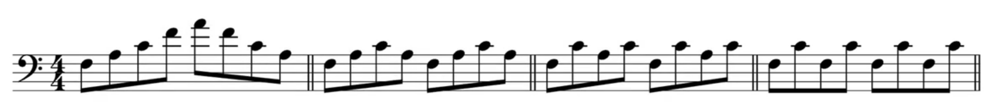
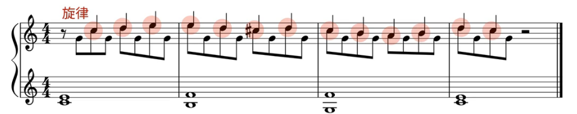

# 核心乐理

## 音程

- 在每个大调里，每一个音到do的距离，都是完全或者大

## 泛音列

- 
- 第二泛音是高8度

## 节奏

### 单拍子复拍子

- 单拍子与复拍子（简单拍子和复合拍子）

- 单拍子（常用）：二四拍、三四拍、四四拍

  

- 复拍子（常用）：六八拍、九八拍、十二八拍

  - 复拍子默认是三个一组的

    

    

### 5 7 11拍子

- 5拍子：《Take Five》

https://www.bilibili.com/video/BV1Xs411374a?p=78

### 切分

- 强拍子 拿掉
- 弱拍子 拉长音
- 和弦切换 / 旋律 提前一点（eg：16分音符）

### 演奏快慢

- 节拍器上的是意大利文，意思都是类似于“快活” ”如同走路的步调“等等 ，并不对应一个确定的数字

### 复节奏

## 五线谱

### 休止符

## 调式与音阶

- 大调小调
  - 大调：1 2 3   4 5    6   7
  - 小调：1 2 b3 4 5 b6 b7

### 小调各种模式

- 自然小调：1 2 b3 4 5 b6 b7

- 和声小调：1 2 b3 4 5 b6 7

  - 把自然小调的b7变成7
  - 自然小调有一个问题：古典音乐家们喜欢5级到1级，究其根本是由于5 7 2 4中的7希望解决到1。但是小调中的5级7和弦是5 b7 2 4，失去了解决的欲望。为了使得他可以被解决，那就让b7变成7。于是，1 2 b3 4 5 b6 7就是出于和声需求考虑的“和声小调”。

- 旋律小调：1 2 b3 4 5 6 7

  - 把和声小调的b6变成6

  - 和声小调虽然解决了5级到1级解决的问题，但是增加了b6到7的一个增二度的音程。而增二度的音程直接跑到了印度，古典音乐家们是不喜欢的。于是把b6变成6,取消增二度

    

# 和弦

## 和弦命名

### 三七十一十三和弦

- 从三和弦到十三和弦（十五和弦的音重复了） 

- 七和弦

  - 大七和弦：1 3 5 7
    - maj7、△7、MA7、M7

  - 小七和弦：1 b3 5 b7
    - m7、-7、MI7

  - 小大七和弦：1 b3 5 7
    - mmaj7、-△7、MMA7、mM7

  - 属七和弦：1 3 5 b7
    - 和弦直接跟一个7

  - 减七：1 b3 b5 bb7
    - dim7、◦7

  - 半减七：1 b3 b5 b7
    - m7b5、ø7

  - 增七和弦：1 3 #5 b7
    - aug7

- 7、11、13和弦

  - 9 11 13音（大调音阶的）并不升降

  

- 三种记号

  

  

  

  

### sus

- 替换三音为2或4
- 如果sus后没有数字，那默认是sus4

### omit

- 省略某音

### ( )

- 对和弦中的某个音进行修改
- C7(#5)：把Sol升半音

## 和弦功能

- 基础功能
  - 1 3 6
  - 2 4
  - 5 7

## 和弦编配

### 增强build-up推进力

- 举例是4-5-1，1进入副歌
  - 演奏4-5的时候，把4级弹成F/G。之后左手是G，右手重复F-G-F-G，但每次都通过转位，让最高音上行
  - https://www.bilibili.com/video/BV1cv411z7dR?spm_id_from=333.337.search-card.all.click

### 12小节蓝调

https://www.bilibili.com/video/BV1Xs411374a?p=7

## 和弦演奏

### Alberti Bass

- Demenico Alberti
  - 阿贝尔替，分解和弦伴奏的始祖
  - 1 5 3 5,1 5 3 5
  - “第一个滥用上述左手伴奏的作曲家”

### Walking Bass

- 打乱和弦顺序
- 加入经过音（do mi中插入re）
- 最后一个音是下一和弦根音的b或#
- 偶尔加入三连音或8分音符

### 理查德·克莱德曼

- Richard Clayderman（法国帅哥hhhh）
  - 1 5 3(8度)  5 3(8度) 5 3(8度) 5
  - 梦中的婚礼、水边的阿蒂罗娜……

### 伴奏琶音

### 紧凑程度

- 从左至右，逐渐紧凑

# 编曲

## 锯齿音型

- 填充物让曲子变得更华丽，但普遍需要是不太变的音，不能喧宾夺主
- 填充物的演奏需要很小声

# 踏板与演奏技巧

## 踏板

### 钢琴构造

- 制音器：在弦上时，弦不会发音

- 手指按下，琴锤飞起打到琴弦。在这之前，制音器已经被抬起。

- 琴弦

  - 右边的一个音对应3根弦，靠左一点的是2跟弦，再左的是1跟弦

  

- 琴锤

  - 压缩羊毛

### 最右踏板 damper pedal

- 制音器踏板
  - 举起钢琴中所有的制音器

### 中间踏板

- 把当下在空中的制音器卡在空中（平台钢琴）
- 用布挡住琴锤（直立钢琴）

### 最左踏板

- 柔音踏板
  - 平台钢琴
    - 把键盘和琴锤右移，使得本来琴锤少敲1根弦
    - 与弦接触久的羊毛会被压缩，偏移后会用柔软的羊毛敲
  - 直立钢琴
    - 把琴锤拉近，使得线速度降低（但一般都没什么用）

### Tips

- 最高音区有部分弦没有制音器

# 视唱练耳

## 绝对/相对音准

- 成年人一定练不出来，只有从3岁开始练钢琴才可以
- 绝对音准并不一定好
  - 找和弦很慢
  - 失真听不出
- 相对音准是现在大多数音乐学校的教学体系
  - 听和弦级数很快
  - 旋律直接就是唱名
- 混合学会出问题

## 如何练习

- 用软件不行

乐理-调式与音阶：
21.★★★★★		大调和小调
22.★★★★★		小调的三种模式
23.★★★★★		七种调式
24.★★★★		Ionian,Dorian,Aeolian
25.★★★★		Phrygian,Lydian
26.★★★★		Mixolydian,Locrian
38.★★★★★		五声音阶
199.★★★★		什么是五声音阶
49.★★★★		Altered Scale
184.★★★★★		判断曲子什么调
113-116.★★★		音律，平均律

几种和弦的特点与应用：
3.★★★★★		加二和弦
16.★★★★★		大和弦的四种口味(大七、大九、大三加六、大三加六九)
18.★★★★★		很潮的属11和弦
19.★★★★★		很爵士的属13和弦
27.★★★★		神秘魔法棒
35.★★★★★		sus2和sus4
36.★★★★		Dm/C
41.★★★★		大和弦里的第11度音
42.★★★★		超酷炫的属和弦变化音
43.★★★★★		小11和弦
44.★★★★★		更多小11和弦的使用方法
45.★★★★		借用和弦
64.★★★★★		减和弦
65.★★★★★		半减和弦
71.★★★★		用简便的思考方式，让属和弦听起来酷炫
83.★★★★★		增六和弦
90.★★★★		让属和弦更帅气与纠结
95.★★★★		隆重登场配乐
201.★★★★		减七和弦的神秘添加物

配和弦，和声进行：
14-15.★★★★★	终止式
28.★★★★★		副属和弦
56.★★★★★		怎样配和弦-只用C和G7
57.★★★★★		怎样配和弦-用C，G7，Dm和F
58.★★★★★		怎样配和弦-用大调的1至6级
59.★★★★★		怎样配和弦-副属和弦应用
60.★★★★★		怎样配和弦-升级成add2和m7
61.★★★★★		怎样配和弦-哪些音可以配C和弦
62.★★★★★		怎样配和弦-哪些音可以配C7和弦
29.★★★★		三全音代理和弦
30.★★★★★		让副属和弦更漂亮的小技巧
67.★★★★★		终止四六和弦
68.★★★★★		经过四六和弦
69.★★★★★		持续低音四六和弦
93.★★★★		使用第一转位
1.★★★★★		流行乐常用和弦进行-低音下行进行(类似于卡农和声进行)【看前面3-5分钟即可，后面都是歌曲示例】
72.★★★★★		卡农和声进行
52.★★★★★		2-5-1和弦进行，转调
154.★★★★★		1-6-2-5和弦进行(另外1-6-4-5也常用)
补充.★★★★★		【非《好和弦》内容】 bilibili：4536251到底让多少人瞬间成为了音痴？
75.★★★★★		半音阶下行的和声进行
82.★★★★★		写出与众不同的和声进行
98.★★★★★		全新的和弦配置思考法
118.★★★★★		简单实用的三个音的和弦配置
119.★★★★★		三个音的和弦配置，用于多乐器合奏
37.★★★★		拿坡里和弦（降二级的大三和弦）
48.★★★★		怎样像007
70.★★★★		林宥嘉《兜圈》分析
74.★★★★		皮卡第三度，出乎意料地使用大和弦
76.★★★★		用属和弦结尾
81.★★★★		把一个旋律编成钢琴独奏曲
90.★★★★		五月天《后来的我们》分析
109.★★★★		Mario终止式
121.★★★★		连续堆叠附属和弦
122.★★★★		连续堆叠教会终止
123.★★★		负面和声
127-128.★★★★	持续低音
129.★★★★		恒定结构
138.★★★★		莫扎特常用结尾
140.★★★★		五月天《成名在望》分析
142-143.★★★★	非功能和声
144.★★★★		低音程限制

即兴旋律与创作：
10.★★★★★		走路低音(Walking base)
17.★★★★★		写出动感的低音线条
32.★★★★★		Dorian即兴
33.★★★★★		两个调式来回切换
7.★★★★		12小节蓝调
34.★★★★		蓝调音阶即兴
39.★★★★		五声音阶即兴
47.★★★★		动机发展：无灵感时写旋律
50.★★★★★		邻音、经过音、倚音
51.★★★★		用高低半音接到目标和弦
92.★★★★		上下夹击目标音
94.★★★★		高低半音的另一个技巧
66.★★★★★		和弦与音阶的对应关系
99.★★★★★		随机挑选和弦
101.★★★★★		为随机选择的和弦配旋律
102.★★★★★		用简单旋律在复杂和弦上即兴
106.★★★★★		11个给创作者的秘诀：避免重复
108.★★★★		照样造句
132.★★★★		肖邦，半音阶使用示例
134.★★★★		拉赫，半音阶使用示例
146.★★★★		没有灵感怎么办-怎样“抄袭”：特征清单
183.★★★		只用三个音写出洗脑广告曲
187-188.★★★★	两个减七和弦合起来的音阶
189-190.★★★★	继续讨论12小节蓝调
205.★★★★		乱配和弦，Jazz Fusion