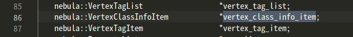
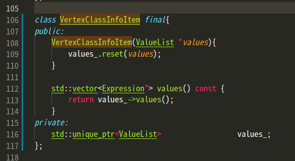
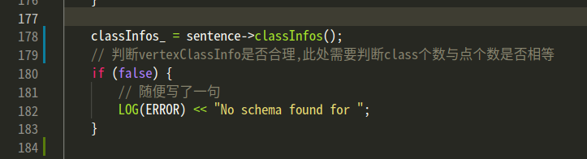
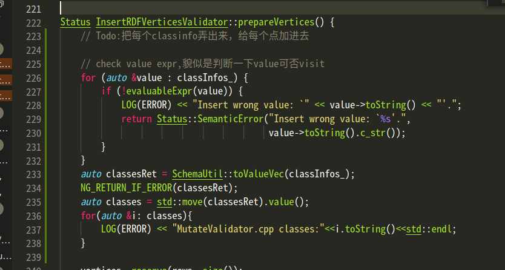
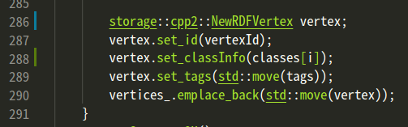
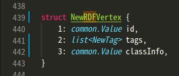
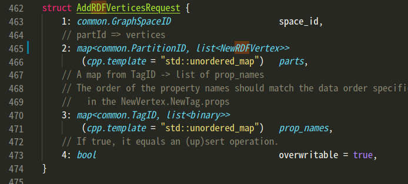
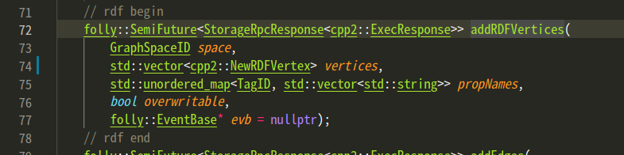
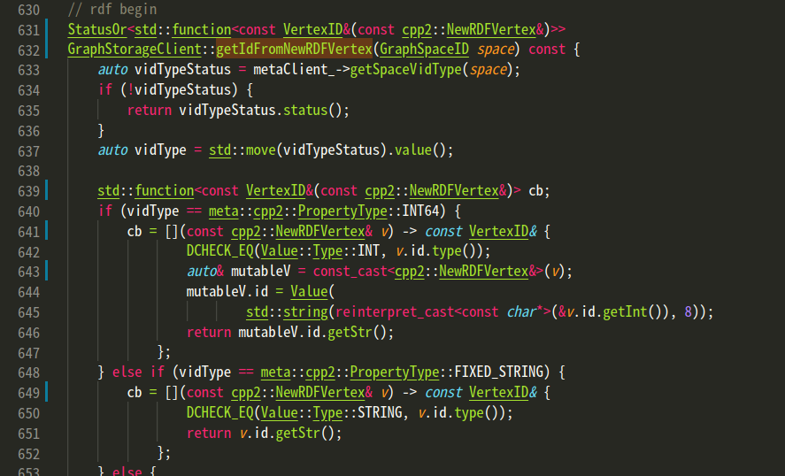
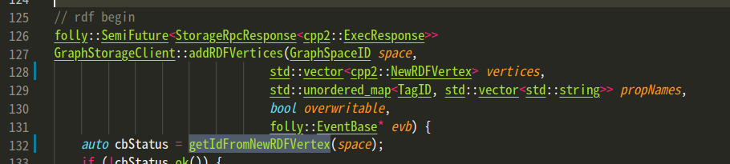

# 博客们

- 关于nebula:Nebula-Graph-源码解读系列-｜-Vol02-详解-Validator
  - https://lequ7.com/guan-yu-nebulanebulagraph-yuan-ma-jie-du-xi-lie-vol02-xiang-jie-validator.html
- 

# 存储格式

- 1.0存储格式：https://nebula-graph.com.cn/posts/nebula-graph-storage-engine-overview/

- 2.0存储格式：https://blog.csdn.net/weixin_44324814/article/details/114631038

- 存储格式
  
  - Key里有PartID原因：用于 **Partition 重新分布(balance) 时方便根据前缀扫描整个 Partition 数据**
  
- meta数据

  - **Meta 如何存储 Schema**

    我们以 CREATE TAG 为例子，当我们建 tag 时，首先会往 meta 发一个请求，让它把这个信息写进去。写入形式非常简单，先获取 tagId，再保存 tag name。底层 RocksDB 存储的 key 便是 tagId 或者是 tag name，value 是它每一个字段里面的定义，比如说，第一个字段是年龄，类型是整型 int；第二个字段是名字，类型是 string。schema 把所有字段的类型和名字全部存在 value 里，以某种序列化形式写到 RocksDB 中。

    这里说下，meta 和 storage 两个 service 底层都是 RocksDB 采用 kv 存储，只不过提供了不一样的接口，比如说，meta 提供的接口，可能就是保存某个 tag，以及 tag 上有哪些属性；或者是机器或者 space 之类的元信息，包括像用户权限、配置信息都是存在 meta 里。storage 也是 kv 存储，不过存储的数据是点边数据，提供的接口是取点、取边、取某个点所有出边之类的图操作。整体上，meta 和 storage 在 kv 存储层代码是一模一样，只不过往上暴露的对外接口是不一样的。

    最后，storage 和 meta 是分开存储的，二者不是一个进程且存的目录在启动的时指定的也不一样。

# 代码结构

## 代码结构及模块说明

### Nebula Graph

- https://nebula-graph.com.cn/posts/nebula-graph-source-code-reading-01/

```
├── cmake
├── conf
├── LICENSES
├── package
├── resources
├── scripts
├── src
│   ├── context
│   ├── daemons
│   ├── executor
│   ├── optimizer
│   ├── parser
│   ├── planner
│   ├── scheduler
│   ├── service
│   ├── session
│   ├── stats
│   ├── util
│   ├── validator
│   └── visitor
└── tests
    ├── admin
    ├── bench
    ├── common
    ├── data
    ├── job
    ├── maintain
    ├── mutate
    ├── query
    └── tck
```

- conf/：查询引擎配置文件目录
- package/：graph 打包脚本
- resources/：资源文件
- scripts/：启动脚本
- src/：查询引擎源码目录
  - src/context/：查询的上下文信息，包括 AST（抽象语法树），Execution Plan（执行计划），执行结果以及其他计算相关的资源。
  - src/daemons/：查询引擎主进程
  - src/executor/：执行器，各个算子的实现
  - src/optimizer/：RBO（基于规则的优化）实现，以及优化规则
  - src/parser/：词法解析，语法解析，：AST结构定义
  - src/planner/：算子，以及执行计划生成
  - src/scheduler/：执行计划的调度器
  - src/service/：查询引擎服务层，提供鉴权，执行 Query 的接口
  - src/session/：Session 管理
  - src/stats/：执行统计，比如 P99、慢查询统计等
  - src/util/：工具函数
  - src/validator/：语义分析实现，用于检查语义错误，并进行一些简单的改写优化
  - src/visitor/：表达式访问器，用于提取表达式信息，或者优化
- tests/：基于 BDD 的集成测试框架，测试所有 Nebula Graph 提供的功能

### Nebula Storage

```
├── cmake
├── conf
├── docker
├── docs
├── LICENSES
├── package
├── scripts
└── src
    ├── codec
    ├── daemons
    ├── kvstore
    ├── meta
    ├── mock
    ├── storage
    ├── tools
    ├── utils
    └── version
```

- conf/：存储引擎配置文件目录
- package/：storage 打包脚本
- scripts/：启动脚本
- src/：存储引擎源码目录
  - src/codec/：序列化反序列化工具
  - src/daemons/：存储引擎和元数据引擎主进程
  - src/kvstore/：基于 raft 的分布式 KV 存储实现
  - src/meta/：基于 KVStore 的元数据管理服务实现，用于管理元数据信息，集群管理，长耗时任务管理等
  - src/storage/：基于 KVStore 的图数据存储引擎实现
  - src/tools/：一些小工具实现
  - src/utils/：代码工具函数

### Nebula Common

```
├── cmake
│   └── nebula
├── LICENSES
├── src
│   └── common
│       ├── algorithm
│       ├── base
│       ├── charset
│       ├── clients
│       ├── concurrent
│       ├── conf
│       ├── context
│       ├── cpp
│       ├── datatypes
│       ├── encryption
│       ├── expression
│       ├── fs
│       ├── function
│       ├── graph
│       ├── hdfs
│       ├── http
│       ├── interface
│       ├── meta
│       ├── network
│       ├── plugin
│       ├── process
│       ├── session
│       ├── stats
│       ├── test
│       ├── thread
│       ├── thrift
│       ├── time
│       ├── version
│       └── webservice
└── third-party
```

Nebula Common 仓库代码是 Nebula 内核代码的工具包，提供一些常用工具的高效实现。一些常用工具包相信各位工程师一定也是了然于心。这里只对其中和图数据库密切相关的目录进行说明。

- src/common/clients/：meta，storage 客户端的 CPP 实现
- src/common/datatypes/：Nebula Graph 中数据类型及计算的定义，比如 string，int，bool，float，Vertex，Edge 等。
- rc/common/expression/：nGQL 中表达式的定义
- src/common/function/：nGQL 中的函数的定义
- src/common/interface/：graph、meta、storage 服务的接口定义

# 代码阅读

## line 1

- 从InsertExecutor.cpp中调用的addVertices函数找到GraphStorageClient.cpp文件

-  GraphStorageClient.h：
  - // A wrapper class for GraphStorageServiceAsyncClient thrift API

- clusterIdsToHosts 函数（GraphStorageClient.cpp)

  ```
      // Cluster given ids into the host they belong to
      // The method returns a map
      //  host_addr (A host, but in most case, the leader will be chosen)
      //      => (partition -> [ids that belong to the shard])
      template<class Container, class GetIdFunc>
  ```

  

  cluster应该是每个分布式的节点。继续向下一层调用的函数应该是client->**future_addVertices**(r)（上图倒数第二行）

- future_addVertices 函数(GraphStorageServiceHandler.h)

  GraphStorageServiceHandler类，继承了自动生成的一个类

  

- future_addVertices函数（GraphStorageServiceHandler.cpp）

  

  - RETURN_FUTURE(processor);

    

    调用了process函数

- AddVerticesProcessor: :instance （AddVerticesProcessor.h）

  

- AddVerticesProcessor构造函数（AddVerticesProcessor.h）

  

  用到了BaseProcessor的构造函数（vertexCache_是直接赋值）

  - BaseProcessor的构造函数（BaseProcessor.h）

    

    这都是直接赋值

- process函数（AddVerticesProcessor.h）

  

## line 2

- 猜想，会不会是clusterIdsToHosts 函数（GraphStorageClient.cpp)中的collectResponse会调用AddVerticesProcessor中的其他操作函数

## line 3

- StorageServer.cpp的start()函数，创建了一个GraphStorageServiceHandler（177行）

## GetNeighborsProcessor

- PropContext里的Prop：Tag包含一些属性，Prop就是其中的 一个属性
  - ex：人(名字，身高)，名字和身高就是Prop

- TagContext:封装 TagID映射到tag的各种信息

  

### GetNeighborsProcessor::buildPlan

- 里面有这样的，下面看StoragePlan是啥

```
    /*
    The StoragePlan looks like this:
                 +--------+---------+
                 | GetNeighborsNode |
                 +--------+---------+
                          |
                 +--------+---------+
                 |   AggregateNode  |
                 +--------+---------+
                          |
                 +--------+---------+
                 |    FilterNode    |
                 +--------+---------+
                          |
                 +--------+---------+
             +-->+   HashJoinNode   +<----+
             |   +------------------+     |
    +--------+---------+        +---------+--------+
    |     TagNodes     |        |     EdgeNodes    |
    +------------------+        +------------------+
    */
    StoragePlan<VertexID> plan;
```

## GO查询语句

- parser.yy

  ```yacc
  go_sentence
      : KW_GO step_clause from_clause over_clause where_clause yield_clause {
          auto go = new GoSentence();
          go->setStepClause($2);
          go->setFromClause($3);
          go->setOverClause($4);
          go->setWhereClause($5);
          if ($6 == nullptr) {
              auto *cols = new YieldColumns();
              if (!$4->isOverAll()) {
                  for (auto e : $4->edges()) {
                      auto *edge  = new std::string(*e->edge());
                      auto *expr  = new EdgeDstIdExpression(edge);
                      auto *col   = new YieldColumn(expr);
                      cols->addColumn(col);
                  }
              }
              $6 = new YieldClause(cols);
          }
          go->setYieldClause($6);
          $$ = go;
      }
      ;
  
  ```

  


# 编译&开启服务

```
mkdir build
cd build

cmake -DENABLE_BUILD_STORAGE=on -DENABLE_TESTING=OFF -DCMAKE_BUILD_TYPE=Debug -DNEBULA_COMMON_REPO_TAG=v2.0.0 -DNEBULA_STORAGE_REPO_TAG=v2.0.0 ..

make -j16

sudo make install-all

sudo /usr/local/nebula/scripts/nebula.service start all

sudo /home/yundao/project/nebulagraph/nebula-console -port 9669 -u a -p b

```

# 执行图操作

- 官方文档（快速入门）：https://docs.nebula-graph.com.cn/2.0/2.quick-start/4.nebula-graph-crud/

```
CREATE SPACE IF NOT EXISTS test_space
USE test_space

CREATE TAG player(name string, age int);
CREATE EDGE follow(degree int);

INSERT VERTEX player(name, age) VALUES "p1":("1", 31);
INSERT VERTEX player(name, age) VALUES "p2":("2", 32);
INSERT VERTEX player(name, age) VALUES "p3":("3", 33);
INSERT VERTEX player(name, age) VALUES "p4":("4", 34);
INSERT VERTEX player(name, age) VALUES "p5":("5", 35);
INSERT VERTEX player(name, age) VALUES "p6":("6", 36);

INSERT EDGE follow(degree) VALUES "p1" -> "p2":(91);
INSERT EDGE follow(degree) VALUES "p1" -> "p3":(91);
INSERT EDGE follow(degree) VALUES "p2" -> "p4":(91);
INSERT EDGE follow(degree) VALUES "p2" -> "p5":(91);
INSERT EDGE follow(degree) VALUES "p3" -> "p5":(91);
INSERT EDGE follow(degree) VALUES "p4" -> "p6":(91);

GO FROM "p1" OVER follow;
GO 2 steps FROM "p1" OVER follow yield $$.age;
GO 1 step FROM "p1" OVER follow where $$.player.name typeof "9";
FETCH PROP ON player "player100"; //查询VID为player100的球员的属性。

// rdf
CREATE TAG rdfplay(name string, age int);
INSERT RDFVERTEX (123) rdfplayer(name, age) VALUES "p1":("Tim Duncan", 42),"p2":("Tom", 21);
```

# nGQL

## GO

```
GO [[<M> TO] <N> STEPS ] FROM <vertex_list>
OVER <edge_type_list> [{REVERSELY | BIDIRECT}]
[ WHERE <conditions> ]
[YIELD [DISTINCT] <return_list>]
[| ORDER BY <expression> [{ASC | DESC}]]
[| LIMIT [<offset_value>,] <number_rows>]

GO [[<M> TO] <N> STEPS ] FROM <vertex_list>
OVER <edge_type_list> [{REVERSELY | BIDIRECT}]
[ WHERE <conditions> ]
[| GROUP BY {col_name | expr | position} YIELD <col_name>]

<vertex_list> ::=
    <vid> [, <vid> ...]

<edge_type_list> ::=
   edge_type [, edge_type ...]
   | *

<return_list> ::=
    <col_name> [AS <col_alias>] [, <col_name> [AS <col_alias>] ...]
```

- `<N> STEPS`：指定跳数。如果没有指定跳数，默认值`N`为`1`。如果`N`为`0`，Nebula Graph不会检索任何边。

- `M TO N STEPS`：遍历`M~N`跳的边。如果`M`为`0`，输出结果和`M`为`1`相同，即`GO 0 TO 2`和`GO 1 TO 2`是相同的。

- `<vertex_list>`：用逗号分隔的点ID列表，或特殊的引用符`$-.id`。详情请参见[管道符](https://docs.nebula-graph.com.cn/2.0/3.ngql-guide/5.operators/4.pipe/)。

- `<edge_type_list>`：遍历的边类型列表。

- `REVERSELY | BIDIRECT`：默认情况下检索的是`<vertex_list>`的出边，`REVERSELY`表示反向，即检索入边，`BIDIRECT`表示双向，即检索出边和入边。

-  `WHERE <conditions>`：指定遍历的过滤条件。您可以在起始点、目的点和边使用`WHERE`子句，还可以结合`AND`、`OR`、`NOT`、`XOR`一起使用。详情请参见[WHERE](https://docs.nebula-graph.com.cn/2.0/3.ngql-guide/8.clauses-and-options/where/)。

  > **说明**：遍历多个边类型时，`WHERE`子句有一些限制。例如不支持`WHERE edge1.prop1 > edge2.prop2`。

- `YIELD [DISTINCT] <return_list>`：指定输出结果。详情请参见[YIELD](https://docs.nebula-graph.com.cn/2.0/3.ngql-guide/8.clauses-and-options/yield/)。如果没有指定，默认返回目的点ID。

- `ORDER BY`：指定输出结果的排序规则。详情请参见[ORDER BY](https://docs.nebula-graph.com.cn/2.0/3.ngql-guide/8.clauses-and-options/order-by/)。

  > 说明：没有指定排序规则时，输出结果的顺序不是固定的。

- `LIMIT`：限制输出结果的行数。详情请参见[LIMIT](https://docs.nebula-graph.com.cn/2.0/3.ngql-guide/8.clauses-and-options/limit/)。

- `GROUP BY`：根据指定属性的值将输出分组。详情请参见[GROUP BY](https://docs.nebula-graph.com.cn/2.0/3.ngql-guide/8.clauses-and-options/group-by/)。

## 引用查询物的属性

### 引用点的属性[¶](https://docs.nebula-graph.com.cn/2.0/3.ngql-guide/4.variable-and-composite-queries/3.property-reference/#_2)

#### 起始点[¶](https://docs.nebula-graph.com.cn/2.0/3.ngql-guide/4.variable-and-composite-queries/3.property-reference/#_3)

```
$^.<tag_name>.<prop_name>
```

| 参数        | 说明               |
| ----------- | ------------------ |
| `$^`        | 表示起始点。       |
| `tag_name`  | 点的标签名称。     |
| `prop_name` | 标签内的属性名称。 |

#### 目的点[¶](https://docs.nebula-graph.com.cn/2.0/3.ngql-guide/4.variable-and-composite-queries/3.property-reference/#_4)

```
$$.tag_name.prop_name
```

| 参数        | 说明               |
| ----------- | ------------------ |
| `$$`        | 表示目的点。       |
| `tag_name`  | 点的标签名称。     |
| `prop_name` | 标签内的属性名称。 |

### 引用边的属性[¶](https://docs.nebula-graph.com.cn/2.0/3.ngql-guide/4.variable-and-composite-queries/3.property-reference/#_5)

#### 引用自定义的边属性[¶](https://docs.nebula-graph.com.cn/2.0/3.ngql-guide/4.variable-and-composite-queries/3.property-reference/#_6)

```
<edge_type>.<prop_name>
```

| 参数        | 说明               |
| ----------- | ------------------ |
| `edge_type` | 边类型。           |
| `prop_name` | 边类型的属性名称。 |

#### 引用内置的边属性[¶](https://docs.nebula-graph.com.cn/2.0/3.ngql-guide/4.variable-and-composite-queries/3.property-reference/#_7)

除了自定义的边属性，每条边还有如下三种内置属性：

| 参数    | 说明                               |
| ------- | ---------------------------------- |
| `_src`  | 边的起始点。                       |
| `_dst`  | 边的目的点。                       |
| `_type` | 边的类型内部编码，正负号表示方向。 |
| `_rank` | 边的rank值。                       |

### 示例[¶](https://docs.nebula-graph.com.cn/2.0/3.ngql-guide/4.variable-and-composite-queries/3.property-reference/#_8)

```
# 返回起始点的标签player的name属性值和目的点的标签player的age属性值。
nebula> GO FROM "player100" OVER follow YIELD $^.player.name AS startName, $$.player.age AS endAge;
+--------------+--------+
| startName    | endAge |
+--------------+--------+
| "Tim Duncan" | 36     |
+--------------+--------+
| "Tim Duncan" | 33     |
+--------------+--------+

# 返回边类型follow的degree属性值。
nebula> GO FROM "player100" OVER follow YIELD follow.degree;
+---------------+
| follow.degree |
+---------------+
| 95            |
+---------------+
| 90            |
+---------------+

# 返回边类型follow的起始点、目的点、边类型编码和边rank值。
```ngql
nebula> GO FROM "player100" OVER follow YIELD follow._src, follow._dst, follow._type, follow._rank;
+-------------+-------------+--------------+--------------+
| follow._src | follow._dst | follow._type | follow._rank |
+-------------+-------------+--------------+--------------+
| "player100" | "player101" | 136          | 0            |
+-------------+-------------+--------------+--------------+
| "player100" | "player102" | 136          | 0            |
+-------------+-------------+--------------+--------------+
```

# 更改记录

## vertex加字段classInfo

### graphd层

- 为了将classInfo插进去+查出来，需要从插入语句形式开始定义。目前支持如下语法插入类信息：

  ```
  CREATE TAG player(name string, age int);
  // 在RDFVERTEX后，tag信息前，写入(...)，需要有左右括号
  // (123，234)为类信息，类型为int64，类的数量与插入点的个数匹配
  INSERT RDFVERTEX (123，234) player(name, age) VALUES "p1":("Tim Duncan", 42),"p2":("Tom", 21);
  ```

- 下面是总的代码修改记录

- parser.yy

  - 为RDFINSERT加入新的格式，第三个的$3是类信息。
    - vertex_class_info_item是(123,234)，使用nebula已经包装好的value_list来包装。

  

  - 为了满足yacc语法，添加一些边角料

    

    

  - yacc定义后，需要c++代码中有对应的类，即实现vertex_class_info_item的VertexClassInfoItem类

- VertexClassInfoItem类（src/parser/MutateSentences.h ）

  - 这里的Expression是仿照nebula使用Value类的方式弄的

  

  - vertex_class_info_item处理好了后，需要修改负责收集全部信息的InsertRDFVerticesSentence类

- InsertRDFVerticesSentence类（src/parser/MutateSentences.h ）

  - 增加一个构造函数

    

  - 加入相应的get函数

    

  - 加入classInfo_的字段

    

  - 至此，信息已经完全从parser收集至类中。InsertRDFVerticesSentence类之后被src/validator/MutateValidator.cpp调用，继续修改。

- InsertRDFVerticesValidator类（src/validator/MutateValidator.cpp）

  - 先加入字段，把信息存住

    - classInfo_

      

  - InsertRDFVerticesValidator类中共有4个相关函数，其执行顺序与调用关系如下

    - validateImpl()：处理上述收集的信息，主要是调用下面2个函数
      - check()：将数据拿出，进行数据是否合理的检查
      - prepareVertices()：准备点信息

    - toPlan()：所有信息处理好了，从validate进入下一步

  - check()

    - classInfo信息从sentence中拿出

      

  - prepareVertices()

    - 从vector\<Expression*\>转为vector\<Value\>，保存在classes中

      

    - 给每个点加入class信息

      

      - 可以看到，这里已经是NewRDFVertex了，下面插入一下如何修改的NewRDFVertex

- 修改storage.thrift接口（modules/common/src/common/interface/storage.thrift）

  - 加入新数据结构NewRDFVertex

    

  - 在Request中使用NewRDFVertex

    

    - 编译生成NewRDFVertex的数据结构后，就可以使用了

- 最后，需要修改一下GraphStorageClient.cpp和.h（modules/common/src/common/clients/storage/GraphStorageClient.cpp），其中有部分函数数据结构不支持NewRDFVertex

  - GraphStorageClient.h（modules/common/src/common/clients/storage/GraphStorageClient.h）

  

  

  - GraphStorageClient.cpp（modules/common/src/common/clients/storage/GraphStorageClient.cpp）

  

  

- 至此，graphd层修改完毕

### storage层

- storage层需要将class信息放入key中，修改较少

- AddRDFVerticesProcessor类（modules/storage/src/storage/mutate/AddRDFVerticesProcessor.cpp）

  - 把每个点的class信息拿出

    

  - 加入key中

    - 这里的LOG会报乱码，没法正常看到

    

## classInfo查出来

- 首先得先知道需要查出什么信息，看看各个推理相关的论文使用什么查询语句
  - inferray：有提到是“自己构建的benchmark”
  - 思卓姐：An Ontology-Aware Unified Storage Scheme for Knowledge Graphs
    - 插入数据的时间：原始版本vs语义版本
      - 语义版本 略慢一点，微乎其微，可以接受
    - 载入后数据大小：元数据vs原始版本vs语义版本vsNeo4j
      - 基本呈现这个趋势：原始版本<语义版本<Neo4j<元数据
    - LUBM给定查询的查询时间：原始版本vs语义版本
      - 语义版本比原始版本快

### GO

- Go 语句生成的子执行打算如下（1step）

  - project->filter->getneighbor->start

- Go 语句生成的子执行打算如下（Nstep）

  ```
  Start -> GetNeighbors -> Project -> Dedup -> Loop -> GetNeighbors -> Project -> GetVertices -> Project -> LeftJoin -> Filter -> Project
  ```

  - Go 语句的性能是实现图的拓展，GetNeighbors 是执行打算中最重要的节点，GetNeighbors 算子会在运行期拜访存储服务，拿到通过终点和指定边类型一步拓展后起点的 id，多步拓展通过 Loop 节点实现，Start 到 Loop 之间是 Loop 子打算，当满足条件时 Loop 子打算会被循环执行，最初一步拓展节点在 Loop 外实现。
  - Project 节点用来获取以后拓展的起点 id
  - Dedup 节点对起点 id 进行去重后作为下一步拓展的终点
  - GetVertices 节点负责取起点 tag 的属性
  - Filter 做条件过滤
  - LeftJoin 的作用是合并 GetNeightbors 和 GetVertices 的后果。

# 坑

- 重定义

  ```
  #ifndef STORAGE_MUTATE_ADDVERTICESPROCESSOR_H_
  #define STORAGE_MUTATE_ADDVERTICESPROCESSOR_H_
  
  #ifndef STORAGE_MUTATE_RDFADDVERTICESPROCESSOR_H_
  #define STORAGE_MUTATE_RDFADDVERTICESPROCESSOR_H_
  
  复制的代码中需要改这个，否则头文件无效了
  ```


- 手动改makelist。。。


2.NebulaKeyUtils.cpp


src/validator/MutateValidator.cpp的check和prepare把点的信息处理好后，调用toPlan把所有信息传出去


# 当前疑问

- 各个算子是怎么连接起来的（数据依赖、执行依赖等）
  - 数据怎么传输的

## GoValidator


## 目标查询语句

```
GO 1 step FROM "p1" OVER follow where $$.type==1;

1. $$.type==1翻译为前缀为1
2.载入系统表，前缀编码->string
```

### mine

$$.type==1翻译为前缀为1

```
GO 1 step FROM "p1" OVER follow where $$.player.name typeof "T";
```


- src/validator/Validator.cpp

- *qctx*->plan()->setRoot(root);


ectx_->initVar(*node*->outputVar());

# 推理

- 基于逻辑的推理
- 基于规则的推理
- 基于分布式的推理

## 本体

**本体概念**
本体（Ontology）首先是哲学上提出来的，简单来说就是一种概念，如人这个概念集合，它是一种抽象集合用来表达世界上的具体的实际的物体，而在人工只能领域上我们主要将本体论的观念用在知识表达上，即借由本体论中的基本元素：概念及概念间的关连，作为描述真实世界的知识模型。当我们输入鱼这个名词，我们知道鱼是一种动物且居住在水里。

**本体语言**
本体用来描述特定领域中的相关知识，主要包括该领域中的概念和这些概念直接的关系，本体描述语言不同，知识描述的性能也各有区别。基于Web标准的本体描述语言包括RDF，RDF(S)，OIL，DAML，和OWL等，本实验中采用OWL语言构建本体。

**本体要素**
OWL的本体构成要素包括：

1. 类：类与面向对象中的类概念相似，是指本体中的一些实例集合，这些实例具有共同的抽象属性。本体中的类也有子类、父类继承关系，继承关系可以应用于推理机制。
2. 属性：属性包括数据属性和对象属性，其中对象属性又可以称为实例之间的关系。数据属性是指个体的属性是数据值，例如中国银行的公司地址；对象属性是指个体的属性是另一个对象，例如贵州茅台的董事长。
3. 实例：实例是指类的实例化个体，个体是领域中我们要扑捉的各个对象，例如三一重工、贵州茅台都是“公司”类的实例，梁稳根、袁仁国则都是“董事长”类的实例。

**本体构建**
在本体构建时，比较著名的软件有Protégé等，Protégé工具的特点是独立于特定的语言，可以导入和导出多种基于Web的本体描述语言格式(如XML，RDF(S)，OWL等)，支持本体开发生命周期中的大多数活动，并且因为都是基于组件的结构，很容易通过添加新的模块来提供更多的功能，具有良好的可扩展性。
但protégé最大的缺陷在于不能批量导入数据，构建大规模本体费时费力，手工输入错误率比较高，效率较低。当数据非常大时使用Protégé会非常的耗时耗力，靠人工创建所有本体是不现实的。因此用程序操作本体是很必要的。Jena是惠普公司开发的一套操作本体的程序。

## 前向后向

**1.前向链接**

 **前项链接** 是数据驱动（data driven）的推理技术。从已知数据开始展开推理。每一次只执行顶端的一条规则。当有规则被触发时，就有新事实加入数据库。这个新的事实的改变又触发了另外一条规则（任何规则只能触发一次）当没有规则可触发时，循环终止。

**2.后向链接**

 **后向链接** 是目标驱动的推理技术。在后向链接中，假设一个既定的结果，从所有规则中的THEN部分有这个结果的，并且数据符合要求。就触发这一条规则。如果不符合就继续以这个IF作为一个下一个规则的THEN部分继续往前推导，看是否符合数据，循环往复，直到所有规则，数据都不可以满足IF的设定。（规则压栈）

## jena

- 知识图谱推理与实践 (2) -- 基于jena实现规则推理 https://www.cnblogs.com/xiaoqi/p/kg-inference-2.html
- jena 简介 https://blog.csdn.net/weixin_40469691/article/details/104165983
- jena官方文档 https://jena.apache.org/documentation/inference/#RULEhybrid
  - 


