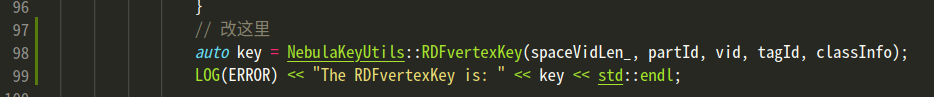

# 更改记录

## vertex加字段classInfo

### graphd层

- 为了将classInfo插进去+查出来，需要从插入语句形式开始定义。目前支持如下语法插入类信息：

  ```
  CREATE TAG player(name string, age int);
  // 在RDFVERTEX后，tag信息前，写入(...)，需要有左右括号
  // (123，234)为类信息，类型为int64，类的数量与插入点的个数匹配
  INSERT RDFVERTEX (123，234) player(name, age) VALUES "p1":("Tim Duncan", 42),"p2":("Tom", 21);
  ```

- 下面是总的代码修改记录

- parser.yy

  - 为RDFINSERT加入新的格式，第三个的$3是类信息。
    - vertex_class_info_item是(123,234)，使用nebula已经包装好的value_list来包装。

  

  - 为了满足yacc语法，添加一些边角料

    

    

  - yacc定义后，需要c++代码中有对应的类，即实现vertex_class_info_item的VertexClassInfoItem类

- VertexClassInfoItem类（src/parser/MutateSentences.h ）

  - 这里的Expression是仿照nebula使用Value类的方式弄的

  

  - vertex_class_info_item处理好了后，需要修改负责收集全部信息的InsertRDFVerticesSentence类

- InsertRDFVerticesSentence类（src/parser/MutateSentences.h ）

  - 增加一个构造函数

    

  - 加入相应的get函数

    

  - 加入classInfo_的字段

    

  - 至此，信息已经完全从parser收集至类中。InsertRDFVerticesSentence类之后被src/validator/MutateValidator.cpp调用，继续修改。

- InsertRDFVerticesValidator类（src/validator/MutateValidator.cpp）

  - 先加入字段，把信息存住

    - classInfo_

      

  - InsertRDFVerticesValidator类中共有4个相关函数，其执行顺序与调用关系如下

    - validateImpl()：处理上述收集的信息，主要是调用下面2个函数
      - check()：将数据拿出，进行数据是否合理的检查
      - prepareVertices()：准备点信息

    - toPlan()：所有信息处理好了，从validate进入下一步

  - check()

    - classInfo信息从sentence中拿出

      

  - prepareVertices()

    - 从vector\<Expression*\>转为vector\<Value\>，保存在classes中

      

    - 给每个点加入class信息

      

      - 可以看到，这里已经是NewRDFVertex了，下面插入一下如何修改的NewRDFVertex

- 修改storage.thrift接口（modules/common/src/common/interface/storage.thrift）

  - 加入新数据结构NewRDFVertex

    

  - 在Request中使用NewRDFVertex

    

    - 编译生成NewRDFVertex的数据结构后，就可以使用了

- 最后，需要修改一下GraphStorageClient.cpp和.h（modules/common/src/common/clients/storage/GraphStorageClient.cpp），其中有部分函数数据结构不支持NewRDFVertex

  - GraphStorageClient.h（modules/common/src/common/clients/storage/GraphStorageClient.h）

  

  

  - GraphStorageClient.cpp（modules/common/src/common/clients/storage/GraphStorageClient.cpp）

  

  

- 至此，graphd层修改完毕

### storage层

- storage层需要将class信息放入key中，修改较少

- AddRDFVerticesProcessor类（modules/storage/src/storage/mutate/AddRDFVerticesProcessor.cpp）

  - 把每个点的class信息拿出

    

  - 加入key中

    - 这里的LOG会报乱码，没法正常看到

    

## classInfo查出来

- 首先得先知道需要查出什么信息，看看各个推理相关的论文使用什么查询语句
  - inferray：有提到是“自己构建的benchmark”
  - 思卓姐：An Ontology-Aware Unified Storage Scheme for Knowledge Graphs
    - 插入数据的时间：原始版本vs语义版本
      - 语义版本 略慢一点，微乎其微，可以接受
    - 载入后数据大小：元数据vs原始版本vs语义版本vsNeo4j
      - 基本呈现这个趋势：原始版本<语义版本<Neo4j<元数据
    - LUBM给定查询的查询时间：原始版本vs语义版本
      - 语义版本比原始版本快
