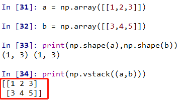
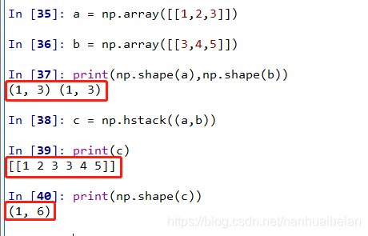
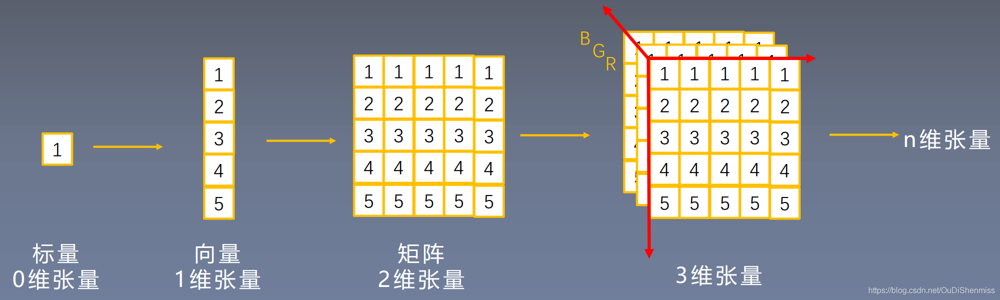
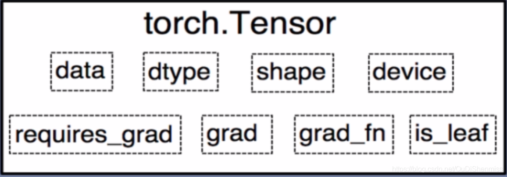
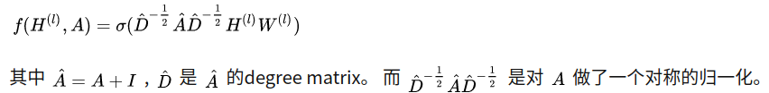
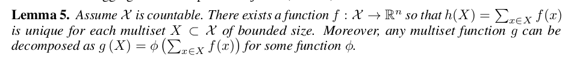

# Anaconda

## 基本命令

```bash
#创建环境
conda create -n your_env_name python=X.X（2.7、3.6等）
#开启环境
conda activate GCN
#关闭环境
conda deactivate
#删除环境
conda remove -n your_env_name --all
```

## 文件路径

- 环境存在这里 /home/yundao/.conda/envs

## 问题

- linux中取消anaconda默认使用base环境
  - https://blog.csdn.net/moshiyaofei/article/details/122062672

# setup.py

打包工具，不具备安装环境的功能

# requirements.txt

```bash
#安装环境
pip install -r requirements.txt
```

# 语法

## 基础

### 数组索引

- "abcde"[1:-1] == "bcd"

## numpy相关

### np.sum

https://www.cnblogs.com/yyxayz/p/4033736.html

- 对于二维矩阵，axis=0就是把**列**相加

```python
a = np.array( [[0, 2, 1]] ) # [1*3]
print a.sum()
print a.sum(axis=0)
print a.sum(axis=1)

结果分别是：3, [0 1 2], [3]

b = np.array([0, 2, 1]) # [3]
print b.sum()
print b.sum(axis=0)
print b.sum(axis=1)

结果分别是：3, 3, 运行错误：'axis' entry is out of bounds

报错原因：对一维数组，只有第0轴，没有第1轴
```

### np.power

- x 和 y 为单个数字：

```
import numpy as np

print(np.power(2, 3))

输出：8

分析：2 的 3 次方。

```

- x 为列表，y 为单个数字：

```
print(np.power([2,3,4], 3))

输出：[ 8 27 64]
分析：分别求 2， 3， 4 的 3 次方
```

- x 为单个数字，y 为列表：

```
print(np.power(2, [2,3,4]))

输出：[ 4 8 16]
分析：分别求 2的 2， 3， 4 次方。
```

- x 和 y 为列表：

```
print(np.power([2,3], [3,4]))

输出：[8 81]
分析：分别求 2 的 3 次方和 3 的 4 次方。
```

### np.flatten

- np.array对象

```python
import numpy as np
a = np.array([[1,2], [3,4]])
print(a)
#[[1 2]
# [3 4]]
print(a.flatten())
#[1 2 3 4]
print(a.flatten('F'))
#[1 3 2 4]
```

- np.mat类型(matrix)

```python
import numpy as np
a=np.mat([[1,2,3],[4,5,6]])
print(a)
#[[1 2 3]
# [4 5 6]]
print(a.flatten())
#[[1 2 3 4 5 6]] #注意，这里和array不同，是两层
print(a.flatten('F'))
#[[1 4 2 5 3 6]]
```

### np.dot

- 一维数组
  - 两数组的內积
- 矩阵
  - 矩阵乘法
  - a.dot(b) 与 np.dot(a,b)效果相同

### np.vstack / .hstack

- vstack
  - 

- hstack
  - 

### np.genfromtxt

- 从文本文件读入，转为numpy的array

### ndarray

- ndarray全称The N-dimensional array,是Numpy中的数据结构,是一个多维数组,存储着相同类型和大小的元素的多维数组


## scipy相关

Python的`scipy.sparse`模块提供了对稀疏矩阵的支持。

### 稀疏矩阵的存储方式

`scipy.sparse`提供了对稀疏矩阵的存储、计算的支持。稀疏矩阵的存储涉及到各种各样的存储方式和数据结构：

### Coordinate list (COO)

#### 基础

其思想是 **按照`(row_index, column_index, value)`的方式存储每一个非0元素**，所以存储的数据结构就应该是一个以三元组为元素的列表`List[Tuple[int, int, int]]`

- COO方式

  - 优点： 转化快速，还能转化成CSR/CSC格式的稀疏矩阵。

  - 缺点： 不支持切片和矩阵计算。

```python
mtx = sparse.coo_matrix((3, 4), dtype=np.int8)
print(mtx.todense())
>>> [[0 0 0 0]
     [0 0 0 0]
     [0 0 0 0]]
#######################################################
row = np.array([0, 3, 1, 0])
col = np.array([0, 3, 1, 2])
data = np.array([4, 5, 7, 9])
mtx = sparse.coo_matrix((data, (row, col)), shape=(4, 4))
print(mtx)
>>>   (0, 0)    4
      (3, 3)    5
      (1, 1)    7
      (0, 2)    9

print(mtx.todense())
>>> [[4 0 9 0]
     [0 7 0 0]
     [0 0 0 0]
     [0 0 0 5]]
#######################################################
#位置有重复时可以相加
row = np.array([0, 0, 1, 3, 1, 0, 0])
col = np.array([0, 2, 1, 3, 1, 0, 0])
data = np.array([1, 1, 1, 1, 1, 1, 1])
mtx = sparse.coo_matrix((data, (row, col)), shape=(4, 4))
print(mtx.todense())
>>> [[3 0 1 0]
     [0 2 0 0]
     [0 0 0 0]
     [0 0 0 1]]
#######################################################
#不支持索引
print(mtx[2, 3])
>>> Traceback (most recent call last):
  File "/Users/shenyi/Documents/Untitled.py", line 21, in <module>
    print(mtx[2, 3])
TypeError: 'coo_matrix' object is not subscriptable
#######################################################
```

- coo_matrix对象有以下**属性**：

  - dtype [dtype]：矩阵中元素的数据类型

  - shape [2-tuple]：获取矩阵的shape

  - ndim [int]：获取矩阵的维度，当然值是2咯

  - nnz：存储值的个数，包括显示声明的零元素(注意)

  - data：稀疏矩阵存储的值，是一个一维数组，即上面例子中的_data

  - row：与data同等长度的一维数组，表征data中每个元素的行号

  - col：与data同等长度的一维数组，表征data中每个元素的列号

- 

#### tocoo()

### csr_matrix(CSR)

- csr_matrix，全称Compressed Sparse Row matrix，即按行压缩的稀疏矩阵存储方式，由三个一维数组indptr, indices, data组成
- 这种格式要求矩阵元按行顺序存储，每一行中的元素可以乱序存储
- indptr存储每一行数据元素的起始位置
  - indptr[i+1]-indptr[i]=第i行数据的个数
- indices这是存储每行中数据的列号与data中的元素一一对应。
  


## torch相关

### Tensor

- 一种特殊的矩阵，带有额外的属性（data之外的），因此可以被训练

  

  

- 有许多创建Tensor的方式

  - 一文理解pytorch张量概念和tensor的三种创建方式：https://blog.csdn.net/OuDiShenmiss/article/details/105843991#t0

  - *out=* 选项是输出的意思

    - *out= out_t* 类似于变量赋值，把生成的tensor**深拷贝**到out_t上

    ```python
    #随便弄一个tensor，等着之后被赋值
    >>> out_t = torch.tensor([1]) 
    
    >>> t = torch.zeros((3,3),out=out_t)
    tensor([[0, 0, 0],
            [0, 0, 0],
            [0, 0, 0]]) 
     tensor([[0, 0, 0],
            [0, 0, 0],
            [0, 0, 0]])
    #证明是深拷贝
    >>> print(id(t),id(out_t),id(t)==id(out_t))
    2511606349000 2511606349000 True
    ```

### ndarray转化tensor

- numpy中的ndarray转化成pytorch中的tensor : torch.from_numpy()
- pytorch中的tensor转化成numpy中的ndarray : tensor_x.numpy()

### torch.sparse.FloatTensor

```
torch.sparse.FloatTensor(indices, values, shape)

indices:tensor,2*n
values:tensor,1*n
shape:元组，( , )
```

### Parameter

```
self.v = torch.nn.Parameter(torch.FloatTensor(hidden_size))
```


### torch.FloatTensor

- 各种Tensor的类型、不同的构造方式：https://pytorch.org/docs/stable/tensors.html （官方文档）

```
torch.FloatTensor(in_features, out_features) 

建立[in_features*out_features]的矩阵
```

### max函数

- 对Tensor的某个维度求最大

- tensor1.max(dim)
  - 500*7时，dim取值0，得到7的tensor ; dim取1,得到500的tensor
  - 函数返回一个可以索引的、由两个东西组成的玩意儿（<class 'torch.return_types.max'>）
  - tensor1.max(dim)[0]：**最大的值**组成的Tensor
  - tensor1.max(dim)[1]：**最大的值的索引**组成的Tensor

```python
#[500*7]的Tensor:x，共两个维度（行和列）
>>>x.max(1)
torch.return_types.max(
	values=tensor([-1.2237e-02, -3.5729e-02, -1.1921e-06,  0.0000e+00,  0.0000e+00,-5.4277e-01, -3.0852e-01], 		                                grad_fn=MaxBackward0>),
	indices=tensor([472, 288, 430,   0,  22, 404, 255])
)

>>>print(x.max(0)[0])
tensor([-1.2237e-02, -3.5729e-02, -1.1921e-06,  0.0000e+00,  0.0000e+00,-5.4277e-01, -3.0852e-01], grad_fn=<MaxBackward0>)

>>>print(x.max(0)[1])
tensor([472, 288, 430,   0,  22, 404, 255])
```

- 如果索引只有0与1,那么x[1]与x[-1]等价

### 激活函数

```python
import torch.nn.functional as F

F.log_softmax(x, dim=1)
```


### 矩阵乘法

- torch.mul(a, b)：矩阵a和b**对应位**相乘，a、b的维度必须相等
- torch.mm(a, b)：矩阵a和b**矩阵相乘**，比如a的维度是(1, 2)，b的维度是(2, 3)，返回的就是(1, 3)的矩阵

### 数据载入

- TensorDataset和DataLoader：https://zhuanlan.zhihu.com/p/371516520

- TensorDataset

  ```python
  import torch
  from torch.utils.data import TensorDataset
  from torch.utils.data import DataLoader
  
  a = torch.tensor([[1, 2, 3], [4, 5, 6], [7, 8, 9], [1, 2, 3], [4, 5, 6], [7, 8, 9], [1, 2, 3], [4, 5, 6], [7, 8, 9], [1, 2, 3], [4, 5, 6], [7, 8, 9]]) #[12*3]
  b = torch.tensor([44, 55, 66, 44, 55, 66, 44, 55, 66, 44, 55, 66]) #[12, ]
  train_ids = TensorDataset(a, b) 
  # 切片输出
  print(train_ids[0:2])
  输出：(tensor([[1,2,3],[4,5,6]]),tensor([44,55]))
  ```

- DataLoader

### 如何写代码

```python
class GCN(nn.Module):
    def __init__(self, nfeat, nhid, nclass, dropout):
        super(GCN, self).__init__()

        self.gc1 = GraphConvolution(nfeat, nhid)
        self.gc2 = GraphConvolution(nhid, nclass)
        self.dropout = dropout

    def forward(self, x, adj):
        x = F.relu(self.gc1(x, adj))
        x = F.dropout(x, self.dropout, training=self.training)
        x = self.gc2(x, adj)
        return F.log_softmax(x, dim=1)
```

- 其中，继承自 torch.nn.Module 或者 from torch.nn.modules.module import **Module**，这两个Module完全等价

# GCN

https://zhuanlan.zhihu.com/p/107162772

- 公式

  

  - A：邻接矩阵[$N_点*N_点$]，I：单位阵
    - 为了在乘的时候不丢失自己的信息，需要让所有(i,i)不为0，所以要加一个单位阵
  - H：属性矩阵，[$N_点*M_{属性}$] 
  - W：系数矩阵（待训练）[]

# GIN

## Weisfeiler-Lehman Test

- 如果经过k轮迭代，最终标号的个数对应一致的，那过程中每一次都是对应一致的
  - 只会出现一开始一样，之后不一样了的情况

## GIN

- 定理
  - 
  - 翻译：1.对于一个向量X，只要他向量的长度是有限的，那么一定存在一个f(x)，使得h(x)是unique的（ h(x)=$\sum_{x\in X}f(x)$ ）
  - 翻译：2.对于一个函数g(X)，一定能被拆解(拟合)成上述形式
  - 简单证明：翻译1
    - f(x)如果设为one-hot编码，那么只要X不同，h(x)就会不同
    - 所以至少有个one-hot的f(x)可以用
  - 简单证明：翻译2
    - g(X)是固定但未知的，那可以通过取不同的X，获得g(X)的值。获得足够多的对应之后，用无敌的MLP拟合一个$\phi$，使得所有的对应都成立。

# GAT

>下面三篇论文递进关系：
>
>Semi-Supervised Classification with Graph Convolutional Networks，ICLR 2017，图卷积网络 https://arxiv.org/abs/1609.02907
>Graph Attention Networks，ICLR 2018.  图注意力网络，就是此篇文章所解析的论文 https://arxiv.org/abs/1710.10903
>Relational Graph Attention Networks ，ICLR2019  关联性图注意力网络，整合了GCN+Attention+Relational

# 奇怪的英文中文对应

- ROW（行）、COLUMN（列）

# IDE

## vscode

### 插入注释

https://www.jb51.net/article/174220.htm

