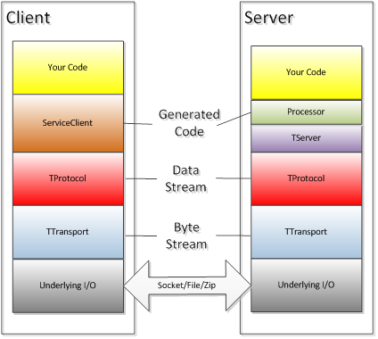

# thrift

## 基础

### thrift协议栈

对于开发人员而言，使用原生的`Thrift`框架，仅需要关注以下四个核心**内部接口/类**：`Iface`, `AsyncIface`, `Client`和`AsyncClient`。

- **Iface**：**服务端**通过实现`HelloWorldService.Iface`接口，向**客户端**的提供具体的**同步**业务逻辑。
- **AsyncIface**：**服务端**通过实现`HelloWorldService.Iface`接口，向**客户端**的提供具体的**异步**业务逻辑。
- **Client**：**客户端**通过`HelloWorldService.Client`的实例对象，以**同步**的方式**访问服务端**提供的服务方法。
- **AsyncClient**：**客户端**通过`HelloWorldService.AsyncClient`的实例对象，以**异步**的方式**访问服务端**提供的服务方法。